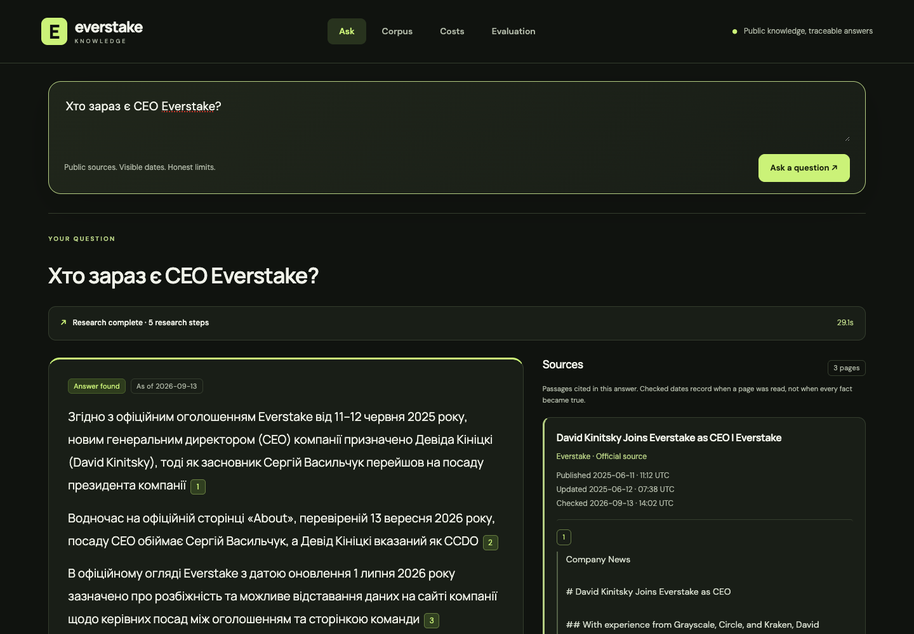

# Everstate Knowledge Base

An Everstake take-home assignment: one readable TypeScript application that answers from a crawled public corpus, shows dated evidence, and measures quality and API spending.

Start with the **[assignment](docs/TEST_ASSIGNMENT_EN.md)** and **[supplied source list](docs/corpus_sources.csv)**. The implementation uses general source, date, scope and citation rules; it has no CEO-specific answer route.

**[Open the live demo](https://everstate-knowledge-base.89-167-19-222.sslip.io)** · 939 documents · 101 offline tests. The final twenty-question agent run passed 95% (19/20) with no unsupported-fact case, versus 55% for the one-pass baseline. Full answers, failures and costs are in [EVAL.md](EVAL.md), [COST.md](COST.md) and [REPORT.md](REPORT.md). The three earlier complete runs (75%, 70%, 80%) are retained; the last two iterations added counterevidence retrieval and focused currentness/scope reviews before a claim is accepted.



## Run locally

Node.js 22.16 or newer is required (`node:sqlite` and FTS5). Provider API calls cost money; browsing saved results does not.

```sh
npm ci
cp .env.example .env
# Fill GEMINI_API_KEY, OPENAI_API_KEY and a private ADMIN_TOKEN.
npm run cli -- crawl
npm run cli -- index
npm run build:web
npm start
```

Open `http://localhost:4318`. The corpus and ledger persist in `data/knowledge.sqlite`; credentials and runtime databases are excluded from Git. `npm run check` runs typechecking and offline fixture tests. YouTube additionally requires `yt-dlp`, `ffmpeg` and `SONIOX_API_KEY`; the Docker image installs its download dependencies.

## Find each block in the code

```text
src/
  contracts.ts          shared document, evidence, answer and receipt shapes
  api.ts                HTTP and live event transport
  application.ts        connects the independent blocks
  providers/            Gemini/OpenAI transport and measured attempts
  services/
    crawler/            discover URLs, robots, download, extract dates/text
    evidence/           remove instructions addressed to AI
    youtube/            relevance, timed speakers, Soniox and Gemini review
    indexer/            chunks and exact/near-duplicate groups
    search/             lexical + embedding search, bounded source reading
    answer/             research actions, arithmetic, citation/support checks
    trust/              explainable evidence score, not truth probability
    measurements/       per-call ledger, costs, retries and receipts
    evaluation/         the same runtime against frozen reference questions
  workflows/            corpus build, refresh staging, activation and resume
  storage/              SQLite schema and small access helpers
web/features/
  live-search/          actual search progress and elapsed timer
  answer-sources/       right-side citations, dates and video time links
  answer/               final result and limitations
  trust/                evidence score and checks
  corpus/               collection status and operator refresh controls
  costs/                every run and its itemized receipt
  evaluation/           questions, difficulty, expected/actual and verdicts
config/                 sources, models, prices and bounded policy
agents/ skills/ prompts/ real runtime instructions
scripts/                operational commands; no hidden runtime dependencies
artifacts/              reproducible manifests and measured evaluation outputs
Costs/YouTube/          video inventory and separate known/unknown charges
```

These are modules in one process, not separately deployed microservices. Each API request follows `api → application → service`; the frontend displays the resulting events rather than inventing progress.

## Collect new data and repeat measurements

```sh
npm run cli -- refresh everstake-com   # force one configured source
npm run cli -- refresh                # all configured sources
npm run cli -- refresh-due            # first-party daily, other sources weekly
npm run cli -- refresh-resume JOB_ID  # reuse a failed job's staged corpus/vectors
npm run cli -- ask "Your question"
npm run cli -- eval agent             # all 20, costs API usage
npm run cli -- eval baseline          # same 20, initial retrieval only
npm run cli -- costs
npx tsx scripts/youtube.ts discover
npx tsx scripts/youtube.ts inventory
npx tsx scripts/youtube.ts transcribe --db=data/youtube-batch.sqlite --ids=REVIEWED_VIDEO_ID
npx tsx scripts/youtube.ts reconcile-costs --db=data/youtube-batch.sqlite
npx tsx scripts/youtube.ts process --ids=REVIEWED_VIDEO_ID
npx tsx scripts/publish-evaluation.ts grades.json   # independent verdicts → EVAL.md
npx tsx scripts/publish-costs.ts                    # ledger → COST.md
npx tsx scripts/import-evaluations.ts               # graded runs → this host's Evaluation screen
```

New pages on a configured site are discovered by the crawler. A new domain needs an entry in `config/sources.yaml`: URL, publisher, authority, inclusion reason and discovery limits. A new format needs an extraction adapter and a fixture test. Refresh builds a staging database and activates text/vectors/version together only after success; its durable job can resume after failure. Only one refresh worker should run. The demo serializes paid questions and refresh requests.

Video discovery is separate from paid processing. Unknown duration or uncertain speaker identity requires review; existing successful jobs are reused. The submitted inventory has pending videos, explicitly counted in [YouTube costs](Costs/YouTube/README.md). Review and import the accepted snapshots before freezing an evaluation corpus; never add evaluation reference answers to that corpus.

The evaluation runner first saves **pending** verdicts. A successful HTTP response is not accuracy: the independent rubric review supplies pass/fail and separately marks cases containing invented facts. Keep all 20 rows, failures and unknown costs. Diagnostic subsets are marked incomplete and are not the final result.

## Submission documents

| Requirement | Evidence |
|---|---|
| Architecture, decisions, scope and limitations | [REPORT.md](REPORT.md) |
| Corpus, dates, duplicates and exclusions | [docs/CORPUS.md](docs/CORPUS.md), [frozen manifest](artifacts/corpus/frozen-manifest.json) |
| 20 questions, five negatives, actual answers and verdicts | [EVAL.md](EVAL.md), [reference audit](docs/evaluation-reference-audit.md) |
| Actual API costs and arithmetic for 50× scale | [COST.md](COST.md), Costs screen |
| Comparison with Everstake's static MCP | [docs/MCP_COMPARISON.md](docs/MCP_COMPARISON.md) |
| One-page process redesign | [PROCESS.md](PROCESS.md) |
| Defence walkthrough and live change | [docs/DEFENCE.md](docs/DEFENCE.md) |
| Requirement-by-requirement audit | [docs/REQUIREMENTS.md](docs/REQUIREMENTS.md) |
| Working history and effort methodology | `git log`, [docs/TIME.md](docs/TIME.md), [transition](docs/REBUILD.md) |

The earlier Claude and Codex prototypes remain in Git history before this branch's retirement commit. They are not dependencies of this implementation. Their local uncommitted work was not included or discarded. New commits preserve real timestamps and the worktree integration history.

Deployment uses `scripts/deploy.sh` and the independent container/port 4318 on the personal server. Existing prototype demos are outside this deployment's scope. Source authority and model-based support checks can still be wrong; the report and evaluation describe observed failures rather than promising perfect factuality.

Video transcripts can be saved before named-speaker review. They remain unreviewed acquisition artifacts until accepted. The proposed source-linked topic-note layer for history and positioning is described in [docs/YOUTUBE_KNOWLEDGE.md](docs/YOUTUBE_KNOWLEDGE.md); it is not yet a second retrieval index.
