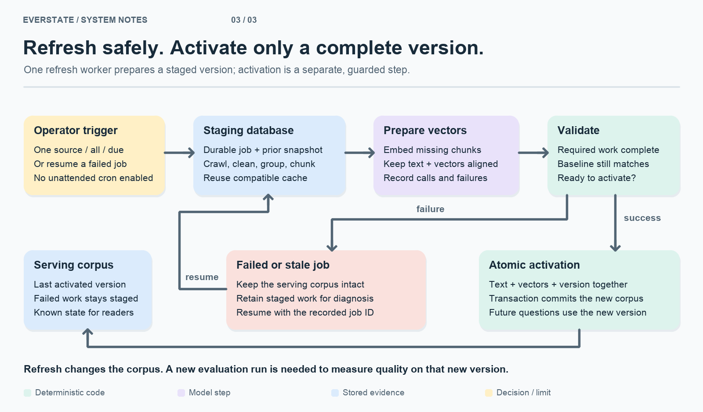

# Everstate Knowledge Base

Ask a question about Everstake. Get an answer grounded in collected public sources, with dates, citations, visible research steps and a cost receipt.

**[Demo](https://everstate-knowledge-base.89-167-19-222.sslip.io)** · **[Assignment](docs/TEST_ASSIGNMENT_EN.md)** · **[Seed sources](docs/corpus_sources.csv)** · **[Evaluation](EVAL.md)** · **[Costs](COST.md)** · **[Part B](PROCESS.md)**

Built for the AI Automation & Agentic Systems Lead take-home assignment. One TypeScript application, one SQLite database, explicit research tools. Gemini generates and reviews answers; OpenAI supplies embeddings. Model IDs and prices live in [config/models.yaml](config/models.yaml).

**Measured on 13 September 2026:** the frozen 939-document corpus produced **19/20 passing answers**, versus **11/20** for the one-pass baseline. The agent run had **one incomplete answer and zero cases marked as invented facts**. These are saved evaluation results, not a claim about every future question or the latest working tree.


*Saved demo capture. Follow a citation to its supporting passage; inspect the research trail, evidence checks and receipt.*

[Run locally](#run-locally) · [Build the corpus](#1-build-the-corpus) · [Answer a question](#2-research-and-check-an-answer) · [Refresh](#3-update-the-corpus) · [Measurements](#quality-and-cost) · [Code map](#find-it-in-the-code)

## Run locally

Use Node.js **22.16+** with `node:sqlite` / FTS5 support. From this repository:

```sh
npm ci
cp .env.example .env
# Set GEMINI_API_KEY, OPENAI_API_KEY and a private ADMIN_TOKEN in .env.
npm run cli -- crawl
npm run cli -- index
npm run build:web
npm start
```

Open **http://localhost:4318**. SQLite creates `data/knowledge.sqlite`; `DB_PATH` and `PORT` are configurable in `.env`. The first crawl collects current pages, so your corpus and answers may differ from the frozen evaluation. Watch the crawl report for exclusions and failures.

`crawl` prepares text and the lexical index; `index` makes paid embedding calls. Asking questions also uses paid APIs. Check the configured model availability and prices for your account before building. Reading the committed reports needs no keys. `npm run check` runs typechecking and offline fixture tests.

YouTube is optional and separate: it needs `yt-dlp`, `ffmpeg` and `SONIOX_API_KEY`. Follow the [video guide](docs/youtube/README.md) for selected-video processing and activation.

## 1. Build the corpus


1. **Choose sources.** [config/sources.yaml](config/sources.yaml) records roots, publisher, authority, inclusion reasons and limits. The crawler expands through permitted sitemaps and same-origin links. External links remain candidates until configured.
2. **Fetch and extract.** Respect `robots.txt`, throttle requests, retain readable text and source dates, and record exclusion reasons. Publication, update and fetch dates stay separate: downloading an old announcement today does not make its claim current.
3. **Remove instructions addressed to AI.** The sanitizer removes matching sentences before indexing and retains an audit. Useful product instructions remain evidence. Search and document reading expose sanitized text with bounded metadata.
4. **Group copies, then index.** Normalized hashes detect exact copies; word-shingle similarity detects near copies, with a numeric-signature guard to preserve changed quantities. Exact copies share indexed text; near-duplicate variants remain searchable because their wording may matter. Source identities and duplicate provenance remain inspectable.

The [web collection report](docs/CORPUS.md) records **935 documents**, **12 extra copies across 6 groups**, and **32 exclusion events**. Four accepted video documents brought the evaluation snapshot to **939**. Later video imports are accounted for separately; they do not retroactively change that evaluation.

**Video is its own evidence path.** Screen relevance and publisher identity, transcribe timed speaker turns with Soniox, then review names, roles and evidence scope with Gemini. Eligible testimony can enter the corpus; interviewer questions do not become company claims. A text-based speaker review cannot authenticate a voice. See [accepted transcripts and processing details](docs/youtube/README.md).

## 2. Research and check an answer


**Find, read, calculate, answer.** Hybrid search combines lexical and embedding matches. The agent can reformulate a query, read more of a retrieved document or calculate from supported operands. Its tools operate on the stored corpus; the answering loop does not browse arbitrary websites or execute shell commands.

**Compare the claim, not just the search rank.** Publisher authority, dates, subject, units and scope matter. For example, a historical network footprint and an active-network count are different metrics. Counterevidence retrieval looks for newer statements and exceptions; model-based reviews check support, currentness and scope. An unresolved conflict should remain visible rather than be settled by counting copies.

**Check before returning.** Code requires citation IDs from the request's evidence registry, checks quantities against cited text and validates the claim's as-of date. Semantic review checks whether the passage actually supports the statement. A rejected draft can be repaired within the step budget. Model-based review can still miss a qualification or accept a mistaken interpretation.

**Make uncertainty visible.** A supported answer carries a value, date and source. A synthesis needs several sources and an actual trajectory over time. Missing evidence produces `no_reliable_answer`; provider failures and exhausted limits produce `error`. A partial answer may be useful but still fail evaluation for omitting a requested conclusion.

**Trust Score comes after the checks.** It explains authority, temporal evidence, grounding checks and distinct content groups. It is a heuristic, not a probability of truth, and cannot override a failed gate. The UI shows actual server events and an itemized API receipt alongside the answer.

## 3. Update the corpus



```sh
npm run cli -- refresh everstake-com  # one configured source
npm run cli -- refresh               # all configured sources
npm run cli -- refresh-due           # only sources due under the policy
npm run cli -- refresh-resume JOB_ID # reuse a failed job's staged work
```

Refresh prepares a staging database using the same collection rules, then builds missing embeddings. Validation and a baseline check precede the transaction that activates text, vectors and corpus version together. Failed work stays staged; the last activated corpus remains available. Run only one refresh worker. The demo serializes paid questions and refresh requests; it has **no unattended refresh scheduler enabled**.

New pages on a configured site need a refresh. A new domain needs a source entry and inclusion rationale. A new format needs an extraction adapter and fixture. The [operator guide](docs/OPERATIONS.md) covers repeatable commands, video processing and publishing measurements.

## Quality and cost

Both modes used the same twenty questions, including five negatives, on `corpus-eae2b2b23116`. The baseline gets six initial passages and one answer turn with the same verification gates; the agent can research and repair.

| Saved run | Passed | Failed | Invented-fact cases | Known API cost | Mean per question |
|---|---:|---:|---:|---:|---:|
| Agent `agent-9a157413` | 19/20 | 1 | 0 | $0.842412 | $0.042121 |
| Baseline `baseline-c656c369` | 11/20 | 9 | 0 | $0.243542 | $0.012177 |

The agent's remaining failure, **E05**, omits parts of the requested two-year trajectory. Earlier complete runs scored 75%, 70% and 80% and retain their unsupported-fact cases. The review is a separate coding-agent rubric audit, not human-certified ground truth or a blind benchmark. Read every answer and qualification in [EVAL.md](EVAL.md).

Every provider attempt has a ledger entry: usage, retries, errors and known or unknown cost. Unknown is not zero. [COST.md](COST.md) contains index tokens, actual usage-priced costs, provider-reported transcription charges and the **50× arithmetic**. Its later collection totals cover more data than the frozen evaluation; query cost does not automatically grow 50× because context and steps are bounded, but retrieval performance must be remeasured.

**Compared with Everstake MCP:** this assistant is designed for dated evidence, conflicting sources and historical synthesis. Everstake's service is better suited to live operational values and staking calculations without maintaining this crawl/index pipeline. This assistant pays for model calls and can miss evidence or serve stale snapshots. The [pinned MCP source comparison](docs/MCP_COMPARISON.md) explains both sides; the baseline above is plain RAG, not an MCP benchmark.

## Find it in the code

These are feature modules in one process. Requests follow `api → application → service`; the browser renders returned events and data.

| Block | Start here | Relevant check |
|---|---|---|
| Source collection | [crawler](src/services/crawler/README.md) | [crawler fixtures](src/services/crawler/) |
| Instruction removal | [sanitize-document.ts](src/services/evidence/sanitize-document.ts) | [sanitizer tests](src/services/evidence/) |
| Copies and chunks | [indexer](src/services/indexer/README.md) | [indexer tests](src/services/indexer/) |
| Search | [hybrid-search.ts](src/services/search/hybrid-search.ts) | [hybrid-search.test.ts](src/services/search/hybrid-search.test.ts) |
| Agent and answer checks | [answer-question.ts](src/services/answer/answer-question.ts) | [answer-question.test.ts](src/services/answer/answer-question.test.ts) |
| Safe refresh | [staged-refresh.ts](src/workflows/staged-refresh.ts) | [staged-refresh.test.ts](src/workflows/staged-refresh.test.ts) |
| Live progress and citations | [live-search](web/features/live-search/README.md), [answer-sources](web/features/answer-sources/README.md) | [frontend fixtures](web/features/) |
| Trust and receipts | [trust-score](web/features/trust-score/README.md), [measurements](src/services/measurements/) | [measurement tests](src/services/measurements/) |

[agents/](agents/), [skills/](skills/) and [prompts/](prompts/) contain actual runtime instruction files. [config/](config/) contains source, model and policy settings. For a live change, start at the relevant module and its adjacent tests.

## Deliverables and limits

| Reviewer needs | Document |
|---|---|
| Architecture, decisions, deliberate cuts, one-month priorities | [REPORT.md](REPORT.md) |
| Corpus composition, duplicates, dates and exclusions | [docs/CORPUS.md](docs/CORPUS.md), [frozen manifest](artifacts/corpus/frozen-manifest.json) |
| All 20 answers, reference answers, verdicts and failures | [EVAL.md](EVAL.md), [reference audit](docs/evaluation-reference-audit.md) |
| Measured spending and 50× extrapolation | [COST.md](COST.md) |
| One-page weekly-report redesign, metrics and human approval | [PROCESS.md](PROCESS.md) |
| Ukrainian defence notes and requirement audit | [docs/DEFENCE.md](docs/DEFENCE.md), [docs/REQUIREMENTS.md](docs/REQUIREMENTS.md) |
| Runbook and editable diagram sources | [docs/OPERATIONS.md](docs/OPERATIONS.md), [diagram guide](docs/images/README.md) |
| Plan, implementation status and effort accounting | [plan](docs/plan/README.md), [execution](docs/EXECUTION.md), [time](docs/TIME.md) |

Known limits: incomplete video coverage, no OCR of image-only facts, no universal prompt-injection defence, and model reviews that can be wrong. Exact vector search and simple duplicate comparisons need reworking at larger scale. The proposed [video topic-note index](docs/YOUTUBE_KNOWLEDGE.md) is not an active retrieval layer.

Earlier prototypes remain in Git history; the active runtime is `src/` and `web/`. Commits retain real timestamps. Human effort, autonomous elapsed time and API spending are recorded separately.
