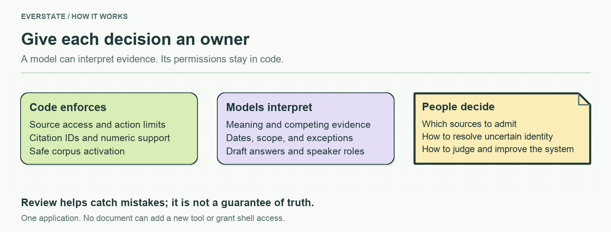
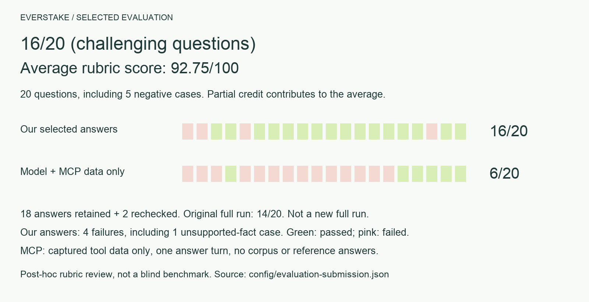

# Everstate Knowledge Base — decisions and results

<!-- submission-summary:start -->
**16/20 (challenging questions), average rubric score 92.75/100.**

18 answers retained and 2 rechecked; not a new full run. Partial credit contributes to the average; 16/20 is the full-pass count. Post-hoc coding-assistant review, not a blind benchmark or probability of correctness.
<!-- submission-summary:end -->

**English** · [Українська](REPORT.uk.md) · [Try the demo](https://everstate-knowledge-base.89-167-19-222.sslip.io/#ask) · [Setup and walkthrough](README.md)

A company’s latest page, an old announcement, and ten copies of that announcement can all disagree. I built a knowledge assistant that shows which evidence supports an answer, what date it describes, and when the available material is insufficient.

This report explains the choices and their measured consequences. **Updated against saved evidence from 13 September 2026; no new evaluation was run for this rewrite.**

## 1. Small enough to explain and change

One TypeScript application serves the browser, runs research and collection, and stores documents and measurements in SQLite. Gemini handles generation and review; OpenAI supplies embeddings. The actual [agent](agents/README.md), [prompts](prompts/README.md), and [evidence guidance](skills/README.md) are editable files.

| Choice | Why I chose it | Cost of the choice |
|---|---|---|
| Feature modules and SQLite, without a RAG framework | Trace a request and change a rule during the defence | Exact vector scanning becomes expensive at scale |
| Bounded research with a repair step | Look beyond the first retrieved passage and correct a rejected draft | More latency and model calls than one-pass answering |
| Visible sources, dates, and real progress | Let the reader inspect the answer instead of trusting a confidence label | More evidence to navigate |

The browser streams real research events and presents cited excerpts beside the answer. Trust Score explains evidence signals; it is not a probability of truth. [Architecture and code map](src/README.md).

## 2. Evidence needs context, not just similarity

The supplied URLs expand through configured links and sitemaps. Crawling respects robots policy, restricts destinations to public addresses, and records exclusions. Blocked sites are coverage gaps, not bypass targets.

**The original evaluation snapshot contains 939 documents: 935 web pages and four video transcripts.** It has 927 content groups and 7,694 passages. Exact copies share indexed text; near-duplicate variants stay searchable because a small wording change can change the fact. Repeated copies do not gain extra authority. [Frozen manifest](artifacts/corpus/frozen-manifest.json) · [Collection decisions](docs/CORPUS.md).

The later saved hosted check contains **941 documents**. Video processing had expanded to **18 transcriptions, with six eligible attributed recordings active**. Uncertain speaker attribution remains outside the index. Later evaluation uses `corpus-664b2e73d71f`; the original snapshot remains historical evidence. [Video processing evidence](costs/YouTube/README.md) · [Hosted snapshot](artifacts/demo/product-pages/verification.json).

Publication, modification, observation, and a claim’s effective date remain distinct. “35+ active networks” and “130+ networks supported over time” cannot establish a decline. Later fixes expose per-claim dates and check relationships between claims. [Diagnostic evidence](docs/research/network-scope-and-dates/README.md).

## 3. Source text cannot grant new powers

Before indexing, rules remove recognized AI-directed instructions and retain an audit. Visible-text extraction, sanitized provenance, and tagged source data reduce ways to smuggle those instructions back into context. Planted-document tests check the normal ingestion path before a model runs.

The researcher can search, read registered evidence, calculate, and propose an answer. It cannot obtain shell access or arbitrary file/URL access from a document. Code checks action shapes, citation IDs, dates, and numeric support. Model reviews inspect semantic support, newer counterevidence, and exceptions to absolute claims.

**These layers reduce risk; they do not prove truth.** Unrecognized attacks, missed passages, and model-review errors remain possible. An evidence-based abstention is distinct from a provider failure or exhausted research limit. A Trust Score cannot override failed checks. [Boundary implementation and tests](src/services/evidence/README.md).

## 4. What the evaluation actually showed

The latest full `core-v2` run passed **14/20 (70%)**, with **one case containing an invented factual relationship**. In E18, the answer incorrectly equated 1,000,000 lamports with 0.0005 SOL. Other failures include incomplete conclusions and reviewer-format errors. Seven separate practical scenarios passed **2/7**; they do not change the core denominator.

After a format fix, E21 and E12 passed a separate **2/2 recheck** costing $0.106771. This gives sixteen questions with a successful answer across runs, **not a new full 80% run**: the other eighteen were not rerun. Original errors and receipts remain visible. [Answers, grading, and rechecks](EVAL.md).

Everstake’s MCP supplies direct operational data; this assistant adds historical and multi-source research. On `core-v2`, a client using captured MCP context passed **6/20**, with zero invented-fact cases. It used different evidence and verification budgets, so this is not a ranking of autonomous MCP clients. Live tools remain better suited to current APY and uptime. [Comparison method](docs/MCP_COMPARISON.md).

## 5. Spending, with the snapshots kept separate

The saved hosted check at **19:08 UTC, 13 September** reports **$5.175148 known cost and eight unpriced calls**. The earlier exported ledger reports $4.462078 and seven unpriced calls. These are successive accounting snapshots, not amounts to add together. Known costs use provider-reported charges or recorded usage and dated prices; unknowns remain unknown. [Hosted record](artifacts/demo/product-pages/verification.json) · [Ledger](costs/measured-ledger.json).

The measured index build used **2,166,597 tokens**. At the recorded embedding rate, its 50× projection is `2,166,597 × 50 = 108,329,850 tokens`, costing **$2.166597**, excluding unpriced attempts. This forecasts embedding spending, not unchanged performance: vector scanning needs a different index and fresh measurements at that scale. Subscription effort and server rental are outside these API totals. [Cost method and breakdown](COST.md).

## 6. What is running, and what I deliberately left out

Saved hosted verification covers a real answer, desktop/mobile navigation, and a successful targeted source refresh. Staging prepares text and embeddings before atomic activation; failed collection preserves the serving corpus. Scheduling exists and is off by default. Public demo update actions have browser-origin guards, **not user authentication**. This is not unattended production readiness or proof of a full all-source/video refresh. [Verification scope](docs/review-logs/2026-09-13-product-pages.md).

I left out full video-inventory processing, OCR/PDF and visual grounding, a historical-revision browser, and distributed ingestion to keep the system explainable and the effort bounded. Coding agents assisted implementation and review; human effort and autonomous elapsed time are disclosed separately, without claiming a complete stopwatch total. [Effort accounting](docs/TIME.md).

With one month, I would prioritize blind evaluation and human calibration, then better date/condition retrieval and video attribution. Next come authenticated operations, freshness targets, staging retention, invoice reconciliation, and a vector index tested at the intended scale. The separate [Part B proposal](PROCESS.md) applies the same principle: models interpret; code controls permissions and delivery; people approve consequential decisions.
