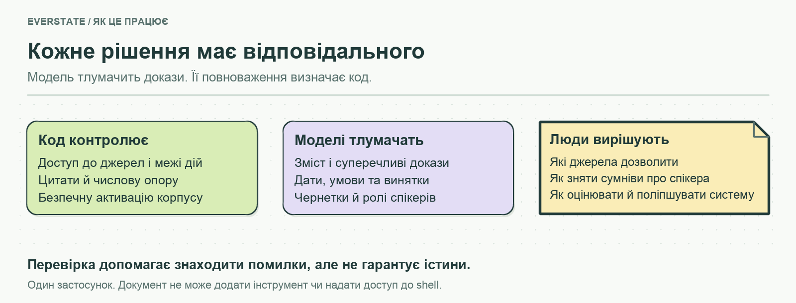

# Everstate Knowledge Base — рішення та результати

<!-- submission-summary:start -->
**16/20 (складні питання), середня оцінка 92,75/100.**

18 відповідей збережено, 2 перевірено повторно; це не новий повний прогін. Середня оцінка враховує часткові бали, а 16/20 — кількість повністю пройдених питань. Оцінювання виконав coding assistant; це не сліпий тест і не ймовірність правильності.
<!-- submission-summary:end -->

[English](REPORT.md) · **Українська** · [Спробувати демо](https://everstate-knowledge-base.89-167-19-222.sslip.io/#ask) · [Запуск і огляд](README.uk.md)

Нова сторінка компанії, давній анонс і десять його копій можуть суперечити одне одному. Я побудував асистента, який показує, які джерела підтверджують відповідь, якого часу вона стосується і коли наявних матеріалів недостатньо.

Цей звіт пояснює рішення та їхні виміряні наслідки. **Оновлено за збереженими даними від 13 вересня 2026 року; нового оцінювання для цього переписування не проводили.**

## 1. Система, яку можна пояснити й змінити

Один TypeScript-застосунок обслуговує браузер, досліджує запитання, збирає джерела та зберігає документи й вимірювання у SQLite. Gemini генерує та перевіряє відповіді; OpenAI створює ембеддинги. [Конфігурація агента](agents/README.md), [промпти](prompts/README.md) та [правила роботи з доказами](skills/README.md) — справжні файли, які можна редагувати.

| Рішення | Навіщо | Компроміс |
|---|---|---|
| Модулі за функціями та SQLite, без RAG-фреймворку | Простежити запит і змінити правило під час захисту | Повний перебір векторів стає дорогим зі зростанням даних |
| Обмежене дослідження зі спробою виправлення | Перевірити більше за перший уривок і виправити відхилену чернетку | Більше часу й викликів моделі, ніж для відповіді за один крок |
| Видимі джерела, дати та справжній прогрес | Дати читачеві перевірити відповідь | Потрібно орієнтуватися в доказах |

Браузер показує реальні події дослідження та цитовані уривки поруч із відповіддю. Trust Score пояснює ознаки якості доказів, але не є ймовірністю істинності. [Архітектура та карта коду](src/README.md).

## 2. Доказам потрібен контекст

Надані URL розширюються через дозволені посилання та карти сайтів. Збір враховує robots-політику, обмежує адреси публічною мережею та записує причини виключень. Заблоковані сайти залишаються прогалинами покриття.

**Початковий зріз для оцінювання містить 939 документів: 935 вебсторінок і чотири відеотранскрипти.** Це 927 груп вмісту та 7 694 уривки. Точні копії мають спільний індексований текст; близькі варіанти залишаються доступними для пошуку, адже мала зміна формулювання може змінити факт. Кількість копій не збільшує авторитет джерела. [Зафіксований склад](artifacts/corpus/frozen-manifest.json) · [Рішення щодо збору](docs/CORPUS.md).

Пізніша збережена перевірка на сервері показує **941 документ**. Обробка відео розширилася до **18 транскрипцій; шість записів із придатними атрибутованими висловлюваннями включено в корпус**. Непевна атрибуція залишається поза індексом. Пізніше оцінювання використовує `corpus-664b2e73d71f`; початковий зріз залишається історичним доказом. [Обробка відео](costs/YouTube/README.md) · [Зріз на сервері](artifacts/demo/product-pages/verification.json).

Дата публікації, зміни, перевірки та набуття фактом чинності мають різні значення. «35+ активних мереж» і «130+ мереж за весь час» не доводять скорочення. Пізніші виправлення показують дату кожного твердження та перевіряють зв’язки між ними. [Діагностичні результати](docs/research/network-scope-and-dates/README.md).

## 3. Текст джерела не надає нових повноважень

Перед індексацією правила видаляють розпізнані інструкції, адресовані ШІ, та зберігають слід перевірки. Виділення видимого тексту, очищення метаданих і позначення джерел як даних зменшують можливості повернути такі інструкції в контекст. Тести з підставленими документами перевіряють звичайний шлях збору ще до виклику моделі.

Дослідник може шукати, читати зареєстровані докази, рахувати та пропонувати відповідь. Документ не може надати йому доступ до shell, довільних файлів чи URL. Код перевіряє структуру дій, ідентифікатори цитат, дати та числову опору. Модельні перевірки оцінюють змістову підтримку, новіші суперечливі джерела й винятки до категоричних тверджень.

**Ці шари знижують ризик, але не доводять істинність.** Невідомі атаки, пропущені уривки та помилки модельної перевірки залишаються можливими. Відмова через брак доказів відрізняється від збою провайдера чи вичерпаного ліміту дослідження. Trust Score не скасовує провалених перевірок. [Реалізація межі та тести](src/services/evidence/README.md).

## 4. Що показало оцінювання

Останній повний прогін `core-v2` дав **14/20 (70%)** та **один випадок вигаданого зв’язку між фактами**. В E18 відповідь помилково прирівняла 1 000 000 lamports до 0,0005 SOL. Інші провали — неповні висновки та помилки формату перевіряльника. Сім окремих практичних сценаріїв дали **2/7**; вони не змінюють знаменник основного набору.

Після виправлення формату E21 та E12 пройшли окрему **повторну перевірку 2/2** вартістю $0.106771. Отже, шістнадцять питань мають успішну відповідь у різних запусках, **але це не новий повний прогін на 80%**: решту вісімнадцять не перезапускали. Початкові помилки та витрати збережено. [Відповіді, оцінки й повторні перевірки](EVAL.md).

MCP Everstake надає прямі операційні дані; цей асистент додає історичне дослідження кількох джерел. На `core-v2` клієнт зі збереженим MCP-контекстом отримав **6/20**, без випадків вигаданих фактів. Його докази та бюджет перевірок відрізняються, тому це не рейтинг автономних MCP-клієнтів. Для поточного APY та uptime доречніші живі інструменти. [Метод порівняння](docs/MCP_COMPARISON.md).

## 5. Витрати з прив’язкою до зрізу

Збережена перевірка сервера о **19:08 UTC 13 вересня** показує **$5.175148 відомих витрат і вісім викликів без визначеної вартості**. Раніший експорт журналу містить $4.462078 і сім таких викликів. Це послідовні зрізи обліку, їх не потрібно додавати. Відомі суми походять зі звітів провайдера або записаного споживання й датованих тарифів; невідоме залишається невідомим. [Запис із сервера](artifacts/demo/product-pages/verification.json) · [Журнал](costs/measured-ledger.json).

Виміряна побудова індексу використала **2 166 597 токенів**. За записаним тарифом ембеддингів прогноз для масштабу ×50: `2 166 597 × 50 = 108 329 850 токенів`, або **$2.166597**, без невизначених витрат. Це прогноз вартості ембеддингів, а не незмінної швидкодії: потрібні інший векторний індекс і нові вимірювання. Підписки на агентів та оренда сервера не входять у ці API-суми. [Методика й деталізація](COST.md).

## 6. Що працює і що я свідомо залишив поза обсягом

Збережена перевірка на сервері охоплює справжню відповідь, навігацію на комп’ютері й телефоні та успішне оновлення окремого джерела. Проміжна база готує текст і ембеддинги перед атомарною активацією; невдалий збір зберігає чинний корпус. Планувальник уже є, типово вимкнений. Публічні дії оновлення демо мають перевірку походження браузерного запиту, **але не автентифікацію користувача**. Це не готовність до автономної промислової роботи й не підтвердження повного оновлення всіх джерел і відео. [Межі перевірки](docs/review-logs/2026-09-13-product-pages.md).

Я залишив поза обсягом обробку всіх відео, OCR/PDF і візуальне підтвердження, перегляд історії редакцій та розподілений збір, щоб система залишалася зрозумілою, а робота — обмеженою. Агенти допомагали реалізації та перевірці; людські зусилля й автономний час описані окремо, без заяви про повний хронометраж. [Облік часу](docs/TIME.md).

Маючи місяць, я почав би зі сліпого оцінювання й людського калібрування, потім покращив пошук дат та умов і атрибуцію відео. Далі — автентифіковане керування, цілі актуальності джерел, очищення проміжних баз, звірка рахунків і векторний індекс із перевіркою потрібного масштабу. Окрема [пропозиція Part B](PROCESS.uk.md) використовує той самий принцип: моделі тлумачать, код контролює права й доставку, люди затверджують важливі рішення.
