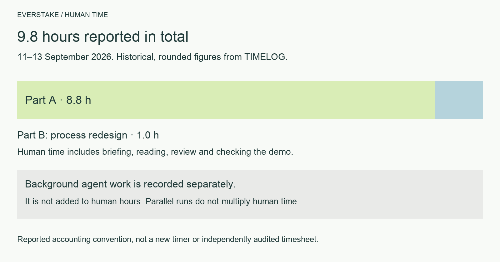

# Everstake take-home: my time and the agents' work

> **УКРАЇНСЬКА ВЕРСІЯ: [TIMELOG](submission_ukr/TIMELOG.md) · [УСЯ УКРАЇНСЬКА ДОКУМЕНТАЦІЯ](submission_ukr/README.md) · [PRODUCT DEMO](https://everstate-knowledge-base.89-167-19-222.sslip.io/)**

> **Historical record, not a new measurement.** Totals and rounding are retained as originally reported by the author. The diagram shows those same reported totals and adds no new hours. Results in the timeline describe the system at that point; see [EVAL](EVAL.md) for the current evaluation results. The earlier event-based count and its limitations are documented in the [effort accounting method](docs/TIME.md); do not add that count to this retrospective total.

I tried to stay within eight hours, although I actually spent a little more. Agents did a lot of the work in the background: I would give them a task, and they would work on their own for several hours. I did not count agent runtime as my own time. My weekend was fairly busy, so I worked on the assignment in chunks: I would often brief an agent and return a couple of hours later to check its work.

## How this works for me

At my company, I set up a system that automatically tracks my time and what I worked on. For our development department, it works like this. At the end of the working day, I run a skill that compiles a report. Its main source is a voice app that converts speech into text and saves each recording with a date and time. Those records show the tasks I assigned during the day. After each task, Claude Code and Codex record what they did and when in a changelog, describing the business task. The skill matches those records: what I asked for and what was delivered.
This document was compiled the same way, from my voice dictations and prompts in Claude Code and Codex. I usually send a formatted report, but here I chose to show the raw prompts so readers can see exactly what tasks I assigned. The quoted prompts below retain their original Ukrainian wording (shortened); headings, explanations and outcomes are in English.

> **How my time was counted.** From the timestamps of my prompts and dictations in Claude Code and Codex. Prompts no more than 10 minutes apart count as one block, from the first to the last. A single prompt counts as five minutes. Time spent reading agent results and checking the demo between prompts was added to the measured intervals. Time when agents worked on their own while I was away from the computer is excluded from my total and shown separately in grey.
>
> **Entry format.** *Italicized quotations* are my dictated prompts in Ukrainian (shortened). The arrow → introduces the outcome.

| Day | My time | Background agents |
|---|---|---|
| Friday 11.09 | 1.5 h | ~7.5 h: first version, Codex version, agent layer |
| Saturday 12.09 | 2.5 h | ~3 h: code readability, costs, freshness, Trust Score |
| Sunday 13.09 | 4.1 h | ~2 h: new version following the plan |
| Sunday 13.09, fixes and time accounting (21:00–22:45) | 0.75 h | |
| **Part A** | **8.8 h** | |
| Part B (21:00–22:45) | 1.0 h | |
| **Total** | **9.8 h** | |

## Friday, 11.09 · 1.5 h

17:04: received the assignment from HR. Deadline: 16.09.

### 19:21–20:09 · 42 min · Assignment, research and planning

- *«Візьми два файли з Telegram, збережи в папку docs, Test Assignment переклади на українську слово в слово, з усім жирним текстом, поруч окремим файлом. Потім проаналізуй задачу і скажи, як, на твою думку, її краще робити»* → assignment and 60 seed URLs in the repository, literal Ukrainian translation, initial architecture ideas
- *«Розпиши пайплайн простою мовою, щоб я розумів кожен крок»* → explanation of crawling, deduplication, indexing and facts
- *«Різати відео не треба: можна знайти на YouTube відео про Everstake, дістати з усіх транскрипти і сформувати базу, бажано автоматичним пайплайном»* → YouTube subtitles instead of speech recognition
- *«Скачай ai-info і MCP, подивись і скажи простою мовою»* → found the CEO trap: Kynytskyi in the press, Vasylchuk on the website
- *«Підключи їхній MCP, потестимо, і подивись, скільки він жре пам'яті й токенів»* → 27 live networks versus “130+” in the profile, ~1.7k tokens per request
- *«Я б робив не MCP, а API плюс skill для Claude Code»* → decision: API + frontend
- *«Для чого їм цей MCP, яка з нього користь компанії?»* → analysis of where MCP is strong and where it is not
- *«Чи варто брати їхній MCP як джерело, якщо в завданні натякають, що він працює не дуже? І для кого він: для клієнтів чи для співробітників?»* → MCP only for live figures, not as the main source
- *«Під API в мене є каркас з попереднього проєкту на TypeScript; дай окремому агенту знайти його і оцінити, чи підходить. Робимо все на TypeScript, бо це моя рідна мова і мені легше пояснювати. Деплоїмо на мій сервер через sslip, щоб працювало не тільки на компі»* → reviewed and rejected the skeleton, reused only the deployment approach; TypeScript stack
- *«Архітектурно мені подобається. Тепер у якому вигляді це показати: в ідеалі не демо, а система, яку можна їм віддати, бо в них та сама проблема, тільки даних у мільйон разів більше. Всередині живе модель, і коли питаєш, хто CEO, вона видає source. І треба вкластися в 5-6 годин, щоб потім не дебажити половину часу. Що порадиш?»* → product requirements added to the plan
- *«Запусти окремого агента, поясни йому детально задачу»* → review of all 60 sites: robots, sitemaps and broken data
- *«Твоє завдання: ще раз детально прочитати завдання і продумати всю систему, кожен етап, крім частини B про облік часу. Продумай усі верифікації, про які вони пишуть, і всі пункти меню. Напиши детальний план, інтуїтивно зрозумілий. Потім зроби каркас і реалізуй усю систему під ключ, разом з тестами. Роби ставку на те, щоб усе було зрозуміло. Я повернуся і порівняю з цим рішенням»* → detailed plan, then Claude Code started building the first version

> **Background agents, 20:20–22:45.** Claude Code built and deployed the first version. From 22:00, Codex independently built a second version for comparison.

### 20:59–22:41 · 15 min · Three short check-ins

- *«Знайди мій Gemini API ключ і перебудуй систему на Gemini, не пали багато коштів. Потім перечитай завдання і перевір, чи всі пункти виконані правильно, чи evaluation виконаний, і зроби дизайн класнішим»* → first evaluation; the CEO question was initially wrong → rule: use the live page as of its collection date
- Claude credits ran out → switched answers to Gemini
- *«Напиши, в чому ідея дизайну, я дам це Claude Design, хай він продумає»* → interface design brief
- *«Створи GitHub-репозиторій і клади туди зміни по часу, це є у вимогах. Веди changelog: коли прийшло завдання, скільки я читав вимоги, коли запустив Claude під ключ. Поточний результат задеплой і поклади в окрему папку claude-work»* → repository and work timeline
- *«Тепер, знаючи всі ці штуки, запусти ще GPT-5.6 і дай йому завдання зробити все під ключ і задеплоїти на мій сервер. Точних інструкцій не давай, щоб він зробив по-своєму, і порівняємо»* → two systems built independently for comparison
- answer model → `gemini-3.8-flash`

> **Background agents, 22:45–03:56.** Agent layer: the model chooses tools itself (search, fact history, live fetch, MCP); steps appear live; numbers are checked against sources; attack suite: 16 pass / 0 fail.

## Saturday, 12.09 · 2.5 h

> **Background agents, 12:45–13:32.** First, safety-net tests (26 → 147 TS, 16 → 283 Python), then both versions rewritten. A 75% / 80% discrepancy between the demo and report was found and fixed.

### 15:20–16:05 · 23 min · How the system works and what we measure

- *«Поясни кожен етап детально: що ми міряємо, чи це реальні заміри, чи приблизні, чи точні токени»* → measurement walkthrough
- *«Ніде не використовуємо Gemini 2.5, тільки 3.8 Flash і Flash Lite»* → 3.x models throughout
- *«Хай Claude і Codex кожен зробить свою оцінку якості, і окрема менюшка на фронті»* → evaluation results page
- *«У вимогах 60 сторінок, а хочуть мінімум 200; YouTube на наш розсуд»* → brief for expanding the sources

> **Background agents, 15:26–17:44.** Costs tracked by stage and question, source freshness policy, source speakers and Trust Score in the Codex version.

### 16:33–18:06 · 93 min · Demo fixes and defence preparation

- *«Стенди подають відповідь сирим markdown, зроби форматовано в обох»* → formatting with escaping, because text from external sites is an injection path
- *«У verify evidence 3 sources, а це одна й та сама сторінка, розберись»* → one card per page
- *«Дамо обом агентам завдання зробити скор: наскільки можна довіряти відповіді»* → Trust Score with an explanation of its components
- *«Канал Everstake на YouTube це просто музика, а ми його парсимо»* → irrelevant videos filtered out
- *«Досліди, як запобігти prompt injection, і допишемо в захист і демо»* → section on injection protection
- *«Evidence ненаочний: незрозуміло, що аналізували і як судили»* → brief for understandable evidence in both versions
- *«Опиши проєкт для агентів; для демо пишемо DEFENCE.md українською, простими тезами»* → project guide, defence notes and demo script
- *«Скільки приносить стейкінг ETH в Everstake?»* → testing the demo with live questions
- *«Як ми захищаємось від дублікатів?»* → explanation of grouping copies of the same page
- *«У завданні питають, як ми даємо раду брудним і неузгодженим даним, як міряємо якість, як ухвалюємо рішення, як реагуємо на зміну вимог; підготуй відповіді»* → answers in the defence notes
- *«Підготуймо демо: презентація через Claude Design і сценарій, як система працює»* → demo script
- *«Тут правило "максимум 6 кроків": чому саме 6, може, варто більше?»* → explanation of the agent step limit
- *«Документи для захисту й для людей пиши людською мовою: коротко, без води, краще менше речень, але влучних»* → documentation style rule
- *«Пройдись по кожному пункту завдання і по коду обох версій»* → critical audit against the requirements
- time accounting: an honest figure instead of “7–8 hours” based on session duration

### Defence preparation · excluded from the count

- After the basic agent was ready, I used my Telegram bot to generate audio explanations for each system section and listened while walking to prepare to defend the demo.

## Sunday, 13.09 · 4.1 h

### 14:40–15:33 · 53 min · Rebuild planning

#### What goes into the new version

- *«У версії Клода класно показуються джерела з цифрами, а в Codex гарно видно, як вона шукає»* → new version combines both
- *«Пройдись по вимогах до тестового по всіх пунктах і випиши всі фічі обох версій»* → full list of features and gaps
- *«Вони хотіли бачити таймлайн: біля джерела має бути видно, як факт змінювався»* → fact timeline added to the plan
- *«Система має бути живою: не натиснув кнопку і через 25 секунд глуха відповідь. У Claude класний таймер, у Codex видно, які джерела беремо і чому»* → live search progress in the plan
- *«Система не має бути заточена під питання про CEO; ось еталонна відповідь, розберись, щоб працювало загалом»* → no question-specific patches
- *«Відкриваєш GitHub і вже зі структури папок усе зрозуміло, щоб я міг пояснити код блоками»* → repository structure designed for explanation
- *«Стаття написана у квітні 2025, потім переїхала на новий домен; дата має лишитись оригінальною»* → source date rule
- *«Вони точно запитають, як система реагує, якщо прямо зараз додати дані»* → data update scenario in the plan

#### Answer quality and costs

- *«Evaluation беремо зі складних питань, які ми вже робили, і використовуємо ще й як тест системи»* → reference question set
- *«На фронтенді красиво показати evaluation: під кожним питанням розписати, в чому його складність»* → evaluation page with explanations
- *«Не 40 питань, забагато грошей; загальний список з 20»* → 20 questions
- *«Хочу бачити, скільки грошей з'їдає кожна відповідь і скільки всього витрачено, окремою таблицею»* → per-answer cost accounting

#### Database and YouTube

- *«Першу базу готуємо агентами Codex, а оновлення бази вже кодом»* → two-stage data preparation
- *«Зібрати якомога більше джерел, не просто 200+»* → full corpus
- *«Найімовірніше, додаткове завдання буде "додали нові дані": система має адаптуватись сама, а я можу доправити й передеплоїти»* → data updates built into the architecture
- *«В мене є свій пайплайн для YouTube, логічно його використати»* → YouTube through Soniox with speaker recognition
- *«YouTube не завжди джерело третього порядку: для історії компанії й розвитку це може бути джерело другого, а то й першого порядку»* → video authority depends on the question type
- *«Gemini має за контекстом визначити роль спікера: "у нас в гостях COO Богдан Опришко"; і перевірити, що спікери не переплутались»* → role verification included in costs
- *«YouTube розпиши окремим детальним підпланом, а в основний план дай посилання»* → separate video plan

#### Repository and execution

- *«Git-репозиторій це наше лице: все в main, дві версії, README не пояснює структуру»* → plan: prototypes in a separate branch, new version in `dev`
- *«План великий, розбий на точні шматки, щоб їх робили різні саб-агенти у worktree»* → task packages for parallel work
- *«Головне не обрізати деталі плану при розбитті на частини»*
- *«Деплой на мій сервер через sslip, назва Everstake Knowledge Base»* → demo address in the plan
- *«Один AGENTS.md на проєкт, де написано, що ми робимо тестове»* → single agent guide
- *«Простіші задачі на одну модель, складні й фронтенд на сильнішу»* → agent assignment
- *«Ти оркестратор: йди по плану, перевір, протестуй, проведи evaluation, не витрачай багато грошей»* → execution begins

> **Background agents, 15:35–17:46.** New TypeScript version: SQLite, cost ledger, 20-case evaluation, hybrid search, safe crawler, atomic database updates, YouTube timestamps and interface. Prototypes removed; live demo.

### 17:31–17:46 · 15 min · Checking the demo from my phone

- *«Розберись, чи агенти Codex виконали план повністю: структура, реалізація, що зроблено, а що ні»* → plan checked against the code
- *«На телефоні питаєш, і далі дуже довгий список, а відповідь аж у кінці, треба гортати»* → answer moved to the top
- *«Вкладення у вкладенні у вкладенні, через це смужка тексту вузька»* → simpler answer structure
- *«Кнопка "Стоп" не працює: зупинив запит, задав нове питання, а мені помилка, що запит ще в процесі»* → request cancellation fixed

> **Background agents, 17:46–18:30.** Claim freshness and scope checked; evaluation rerun: agent 19/20 versus baseline 11/20.

### 18:00–21:00 · 3 h · Main coding session at home

#### Sources and data

- *«Визнач, які відео нам підходять, дай список URL і відкрий у браузері»* → 12 videos: recent first, then historical
- *«Транскрипція через Soniox. Історія й позиціювання можуть погано лягти на ембединги, бо в питанні не буде слова "позиціювання"; може, окремим блоком?»* → videos as a separate source of context, not just facts
- *«Обов'язково порахуй у витратах, скільки Soniox бере за обробку відео»* → transcription in the cost report
- *«У нас "спікер 1", "спікер 2", але ми не знаємо, хто це»* → names and roles inferred from the conversation context
- *«Ведучий каже "ви підтримуєте 2000 блокчейнів", а COO відповідає "насправді 130"; не можна, щоб слова ведучого стали фактом»* → only verified statements by Everstake employees enter the corpus; host questions and false premises are excluded
- *«Назви відео: спочатку дата, потім посада, прізвище й ім'я, потім тема, і так само на GitHub»* → 18 transcripts with readable names
- *«На цьому питанні модель помилилась: у них 35 мереж активно і 130 за весь час. Без локальних затичок, розберись, чому система відпрацювала неправильно»* → each claim carries its date and scope (current or cumulative)
- *«Саме для стейкінгу, а не загалом, скільки мереж підтримують»* → clarification of the question's meaning
- *«У завданні сказано: давати посилання на джерело і дату, коли новину опублікували, і писати це у відповіді»* → source dates in answers
- *«Оновлення даних має бути окремим пунктом меню: автоматично з частотою в налаштуваннях і кнопкою "оновити", і воно не має перетерти наявні дані»* → Updates section with safe updates
- *«Розділ Updates незрозумілий: що з ним робити і як ним користуватись, перепродумай»*
- *«Я очікував велику кнопку "Оновити": натискаєш, іде прогін, і видно візуалізацію оновлення»* → update button with progress

#### Answer quality and safety

- *«Придумаймо нестандартні складні питання, покроули сайти нормально»* → new difficult cases
- *«Досліди, чому система не впоралась. Не описуємо часткові випадки, покращуємо систему в цілому»* → retest: the system explicitly names the unresolved discrepancy instead of inventing an explanation
- *«Нові питання додай у розділ Evaluation, а менш цікаві заміни; питання про CEO залиш»* → updated difficult question set
- *«На новій гілці main: чи нормально опрацьовується prompt injection? Проведи аудит»* → correct architecture (poisoned text removed during collection); detector needs strengthening
- *«Якщо ці фікси ще актуальні на оновленій гілці, внеси їх, щоб система не ловила prompt injection, і задеплой»* → stronger injection protection

#### README

- *«Потрібен якісний README без води, по секціях, з візуалізаціями, як у моєму репо LiquidityScan; схеми намалюй через OpenCV»* → README with diagrams
- *«Дивлюсь dev, а коміта з README там нема, розберись»* → README published in dev and main
- *«README має показувати, яку роботу я зробив, і пояснювати кожну частину, наприклад, як захищаємось від prompt injection»*
- *«Схеми гарні, але людина зі сторони нічого не зрозуміє, спрости. І зроби український README зі схемами українською»* → Ukrainian README
- *«Не прямими відповідями на вимоги, а тонко, навколо них»*
- *«Три схеми однотипні, лінійні "крок 1, 2, 3"; у нас складніша система, зроби різні форми й кольори в одному стилі і більше схем»* → eight diagrams, each explaining a separate mechanism
- *«Подивись схеми в LiquidityScan, це небо і земля; вмикай креатив, але в одному стилі»*
- *«Англійський README онови під український, з усіма схемами англійською»*

#### Interface

- *«Перебудуй дизайн всієї системи під дизайн-систему з Claude Design, не тільки UI, а й UX; дизайнер міг не знати, як працює продукт, тож дивись як продакт»* → website redesign
- *«Дизайн у кольорах компанії: не лише дизайн-система, а всі UI-фрейми і UX, куди виводиться відповідь, як наступне питання, як дивитись витрати»* → Claude Design brief
- *«Відповідь займає чверть екрана, треба ширше; кнопку статистики менше, і не прибрати, а перенести, бо там цінна інформація»* → new answer page layout
- *«Пройдись по всіх пунктах меню: чи всюди інформація має сенс, чи добре видно цитати»* → review of all sections
- *«Це не просто редизайн, а й продуктові зміни, бо місцями виглядає не дуже»* → product improvements across sections
- *«Поясни дизайн-агенту нову фічу з датами: що вона робить і в яких файлах лежить»* → design brief
- *«Закоміть фічу в dev, потім влий у main, щоб main був актуальний»*
- *«Corpus: 941 сторінка в незручному вигляді; зроби списком, як таблицю, одна строка на документ»* → list instead of pages
- *«Сторінка витрат неінформативна: скільки коштує один запит, скільки пішло на Soniox, на Gemini, на ембединги OpenAI, скільки коштує одне оновлення»* → costs broken down by provider
- *«Evaluation: написано 95, а поруч 20 з 20; розділи на прості й складні питання»* → results explained visually
- *«Клік на назву вгорі зліва має вести на головну»*
- *«Порівняй evaluation з їхнім офіційним MCP і покажи на фронті»* → our system 95%, baseline 55%, MCP 35%
- *«Findings є в коді, але на сайті нема, зроби окрему категорію і детально опиши»* → section with four documents: slashing, tax reporting, insurance and NIST CSF
- *«Все англійською, а Findings українською; всередині розділу зроби дві мови»* → EN / UA switch
- *«Відкрилась стара версія сайту, хоча в dev і main уже новий дизайн»* → publication from one verified version so frontend and backend match
- *«Сторінка зараз виглядає зламано, пофікси після всієї роботи»*

#### Defence preparation

- *«Розкажи простою розмовною мовою, як працює система; мені зручно слухати в аудіо»* → audio explanations by section, shorter than the previous ones
- *«Короткі версії озвуч різними українськими голосами»* → choosing the best voice for the long versions

## Sunday, 21:00–22:45 · Fixes, time accounting and Part B

### Fixes after checking the demo · 0.75 h including time accounting

- *«У EVAL має бути таблиця з 20 питань, метрики і чесний розбір невдач; так само покажи це на сайті»* → evaluation section with failure analysis
- *«На складних питаннях зараз 14 з 20, а минулого разу було 19 з 20; зосередимось на технічних збоях, проженемо питання ще раз»* → rerun after fixes
- *«У README біля evaluation напиши, що на сайті це показано наочніше, і дай посилання»*
- *«Натиснули кнопку оновлення бази, і спрацювало не всюди; подивись логи і розберись чому»* → update failure investigation
- *«Ті частини, що оновились, мають оновитись, а ті, що впали, не мають ламати решту; не "все або нічого"»* → updates by part, in a separate worktree from dev

### Part B: report automation · 1.0 h

- *«Прочитай тестове: що треба в задачі B на 1 годину»* → analysis of Part B requirements
- *«Опишу, як я вже будував таку систему: скіли для щоденних звітів, кілька поколінь»* → basis for the text
- *«Трекер задач: у Jira є MCP, таймлоги можна діставати звідти»*
- *«Дзвінки: у нотетейкера є API, він знає, про що говорили, тривалість і хто був на зустрічі»*
- *«Кожен відділ використовує свої системи, до них теж можна під'єднатись»*
- *«Бухгалтер працює у своїй обліковій системі, звіту з неї не буде, але через Claude Code підключення часто налаштовується за пів години»*
- *«Повністю автономна система може тягнути казуси у звіт, тому людина підтверджує звіт перед відправкою»*
- *«Система сама запускається і збирає звіт, людині лишається трохи підправити й відправити; це знімає більшу частину навантаження»*
- *«Якщо люди не відправляють звіти: о 18:30 приходить чернетка, а о 19:30 система передає те, що є»*
- *«Звіт збирати щодня, а не в кінці тижня»*
- *«Виглядає занадто по-AI-шному, напиши моєю мовою, як я це робив»* → text in human language
- *«Намалюй діаграму через OpenCV і вклади в README»* → process diagram
- *«Сконвертуй у PDF українською»*
- *«Зберімо з моїх диктовок і промптів таймлайн задач за п'ятницю–неділю: що я просив агентів і що з цього вийшло»* → this time accounting document
