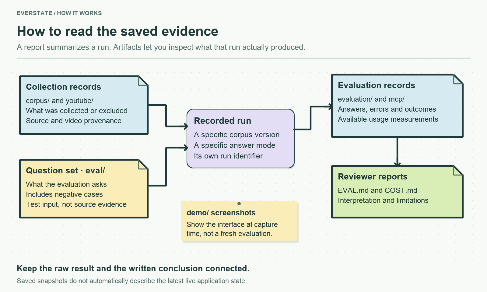

# Saved evidence of runs

These are saved crawl reports, answers, evaluations, screenshots, and video-processing results. They let a reviewer inspect what happened during a particular run without repeating paid API calls.

Run IDs and video IDs connect related files. A snapshot records its own run, not necessarily the current live state. The mutable application database is kept outside this folder.

