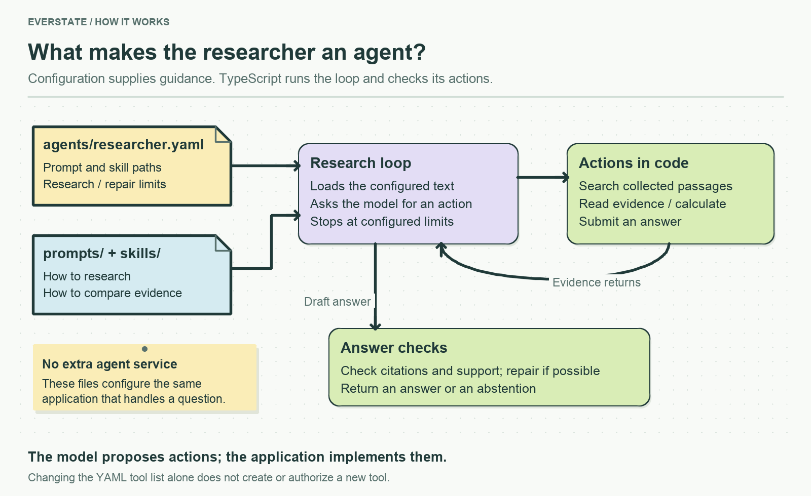

# The researcher's definition

Open [researcher.yaml](researcher.yaml). This is the configuration of the researcher answering corpus questions, not a separately deployed agent or a development-tool plugin.

| Setting | What it controls | Where the behavior runs |
|---|---|---|
| `prompt` and `skills` | Files whose instructions are combined for research | [answer-question.ts](../../src/services/answer/answer-question.ts) |
| `maxSteps` | Research-turn limit | The answer loop |
| `maxRepairSteps` | Additional turns to repair a rejected draft | The same loop; repair turns cannot use research tools |
| `tools` | Inventory of implemented actions | [research-action.ts](../../src/services/answer/research-action.ts) validates their shape; TypeScript dispatches them |

[config.ts](../../src/config.ts) validates this definition. Editing the tool list does not implement a new capability. For a live change to the research budget, change the relevant limit here and run the answer tests; a larger limit can mean more paid work.

