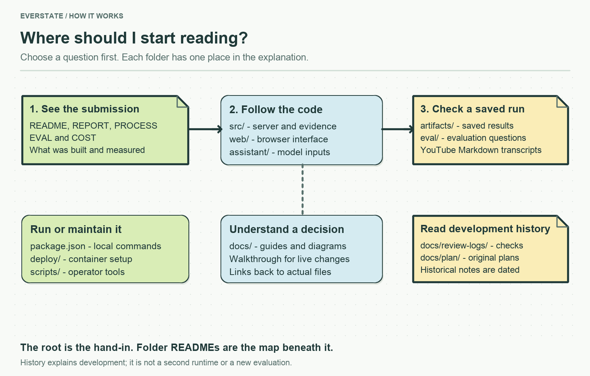

# Find the explanation you need

For the submission itself, start with the root [README](../README.md) ([українською](../submission_ukr/README.md)). This folder explains decisions, operation and development history. Ukrainian translations of the root submission documents live separately in [submission_ukr](../submission_ukr/README.md).

## Understand or change the application

| Your question | Read |
|---|---|
| What does the assignment require? | [Original assignment](TEST_ASSIGNMENT_EN.md), [український переклад](TEST_ASSIGNMENT_UA.md), [supplied sources](corpus_sources.csv) |
| What does each part of the code do? | [Code walkthrough in Ukrainian](CODE_WALKTHROUGH.uk.md), [server module map](../src/services/README.md) |
| What should I show at the defence? | [Ukrainian speaker notes](DEFENCE.md) |
| How do I collect sources or run a command? | [Operator guide](OPERATIONS.md), [script map](../scripts/README.md), [container setup](../deploy/README.md) |
| Where can I read the YouTube transcripts? | [Video catalogue](../artifacts/youtube/reviewed/README.md), [speaker/evidence rules](youtube/README.md) |
| How are collection and updates handled? | [Corpus](CORPUS.md), [updates](UPDATES.md) |
| What configures the model? | [Agent, skills, prompts and settings](../assistant/README.md) |
| Where are the diagrams and their source? | [Image catalogue and rendering commands](images/README.md) |

## Inspect the measured result

The root [REPORT](../REPORT.md), [EVAL](../EVAL.md), [COST](../COST.md) and [PROCESS](../PROCESS.md) are the reviewer deliverables. [Saved artifacts](../artifacts/README.md) let you follow them back to evidence.

Supporting details: [MCP comparison](MCP_COMPARISON.md), [evaluation reference audit](evaluation-reference-audit.md), [execution status](EXECUTION.md), [human time accounting](TIME.md). [COST українською](../submission_ukr/COST.md) explains the distinct spending snapshots.

## Inspect how it was built

| Folder or record | Why it is retained | Needed to run? |
|---|---|---|
| [review-logs](review-logs/README.md) | Findings, fixes and the checks performed | No |
| [plan](plan/README.md) | Approved execution packages and original design choices | No |
| [history](history/README.md) | Earlier drafts and prototype context | No |
| [research](research/README.md), [github-map](github-map/README.md) | Investigations and source-repository notes | No |
| [time](time/README.md) | Recorded effort evidence | No |
| [Transition record](REBUILD.md) | Why only one implementation is active | No |

Historical statements describe their recording time. They do not override today's code or create new measurements. Review logs are kept deliberately: they explain which checks support a change and which were not run.
