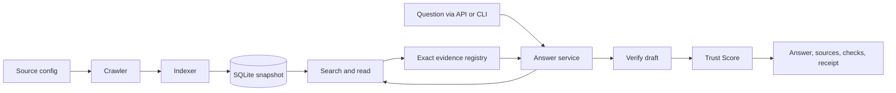

# Архітектура: TypeScript, прості сервіси в одному застосунку

## Головне рішення

Один репозиторій, один Node.js-застосунок, одна SQLite-база. Сервіс тут — папка з предметною логікою, функціями й тестами. Так можна відкрити `src/services/crawler` і зрозуміти весь збір документів, не шукати його по транспортних шарах.

Межі модулів потрібні для читання коду й незалежної перевірки. Окремі deployments, брокер повідомлень, DI-контейнер, event sourcing і мережеві виклики між сервісами для цього обсягу зайві.

## Структура як навігація на захисті

Пріоритет користувача: GitHub має пояснювати систему вже назвами папок і файлів. Кожний змістовний блок екрана має своє місце в `web/features`, кожний механізм — у `src/services`. Кореневий README містить карту «функція → папка → головний файл → тест». Усередині кожної сервісної та feature-папки короткий README показується GitHub автоматично.

Мета — за пів хвилини знайти блок, відкрити головну функцію й пояснити її вхід, послідовність дій та вихід. Блоки є маршрутом до коду, а не заміною його розуміння: §9–10 завдання вимагають пояснювати й змінювати будь-яку частину реалізації. Для цього функції мають бути простими, а відповідальність — локальною.

## Карта папок

Це запропонована структура. Файли створюються тоді, коли з'являється відповідна робота; порожні абстракції наперед не генеруємо.

```text
src/
  main.ts                       # Connect real dependencies once
  cli.ts                        # Parse arguments and call workflows
  api.ts                        # HTTP validation and response streaming
  contracts.ts                  # Small shared data types
  config.ts                     # Read and validate configuration
  workflows/
    build-corpus.ts             # Crawl -> index -> publish snapshot
    refresh-corpus.ts           # Recheck -> process changes -> publish
  services/
    measurements/
      measure-run.ts            # Start and finish measured work
      record-api-call.ts        # Persist each provider attempt
      build-receipt.ts           # Read actual costs from recorded calls
      build-receipt.test.ts
    crawler/
      crawl-source.ts           # Main entry: collect one configured source
      check-source-changes.ts   # Recheck known pages and report changes
      discover.ts               # Seeds, sitemaps and bounded links
      fetch.ts                  # Robots, redirects, limits and retries
      extract.ts                # HTML/Markdown -> document sections
      crawl-source.test.ts
    indexer/
      build-index.ts            # Main entry: create a searchable snapshot
      deduplicate.ts
      chunk.ts
      build-index.test.ts
    search/
      search-corpus.ts          # Main entry: find relevant passages
      rank-candidates.ts        # Rank fusion and evidence diversity
      read-document.ts          # Read a bounded section with continuation
      search-corpus.test.ts
    evidence/
      sanitize-document.ts      # Remove AI-directed instructions
      register-evidence.ts      # Exact visible passages and stable IDs
      verify-answer.ts          # Schema, citations, dates and quantities
      calculate.ts              # Bounded source-backed arithmetic
      verify-answer.test.ts
    answer/
      answer-question.ts        # Main entry: one bounded agent loop
      tools.ts                  # One registry: schema, execute, label
      run-events.ts             # Typed progress events for API, CLI and eval
      answer-question.test.ts
    trust/
      score-evidence.ts         # Main entry: score and explain evidence
      score-evidence.test.ts
    evaluation/
      run-evaluation.ts         # Run questions through answer service
      grade-answer.ts           # Independent evaluation rubric
      run-baseline.ts           # Plain RAG and MCP comparison adapters
      build-eval-report.ts      # Shared result object for UI and Markdown
      write-eval-report.ts      # Generate EVAL and comparison tables
      run-evaluation.test.ts
      grade-answer.test.ts
  providers/
    model-client.ts             # Metered generation and embedding calls
    gemini.ts                   # Provider-specific request/usage parsing
    openai.ts                   # Embedding request/usage parsing
  storage/
    database.ts                 # Connection and transactions
    schema.sql                  # Inspectable tables
web/                            # Screen features have their own folders
  app.ts                        # Mount features and connect their events
  run-state.ts                  # State of the current request only
  transport/
    read-run-stream.ts          # POST SSE parsing and run isolation
  shared/
    source-date.ts              # Common date labels; no truth inference
  features/
    question/
      question-form.ts          # Submit a question or cancel a run
    live-search/
      search-timeline.ts        # Actual search/read steps as they arrive
      search-results.ts         # Found, repeated and set-aside passages
      elapsed-timer.ts          # Total and active-step elapsed time
      search-timeline.test.ts
    answer/
      answer-view.ts            # Final text and numbered citations
    answer-sources/
      source-cards.ts           # Final cited sources with visible dates
      citation-navigation.ts    # Citation click -> exact passage
      citation-navigation.test.ts
    verification/
      verification-checks.ts    # Passed/failed checks and rejected draft
    trust-score/
      trust-score.ts            # Score, component contributions and reasons
    costs/
      cost-receipt.ts           # Cost of this request, step by step
      cost-overview.ts          # Total spend, builds, evaluation and refresh
    evaluation/
      evaluation-page.ts       # Run selection, summary and filters
      question-result-card.ts  # Difficulty, expected/actual, verdict and baseline
      evaluation-page.test.ts
    request-error/
      request-error.ts          # Budget, provider and connection failures
config/
  sources.yaml                  # Where to crawl and why
  models.yaml                   # Actual provider/model IDs and prices
  policy.yaml                   # Limits, date rules and Trust weights
agents/                         # Real agent definitions
skills/                         # Short operating rules
prompts/                        # Model instructions
eval/                           # Questions, references and test fixtures
data/                           # Runtime state; excluded from source Git
artifacts/                      # Selected sanitized evaluation evidence
README.md
REPORT.md
EVAL.md
COST.md
PROCESS.md
```

У дереві наведено головні файли та приклади тестів, а не вичерпний список. Кожна feature/service-папка також отримує короткий `README.md`; стилі та додаткові тести живуть біля відповідного блоку, коли вони потрібні. Дрібні labels, badges й кнопки не створюють окремих features. Corpus-browser, коли реалізується, має власну `web/features/corpus` за тим самим правилом.

Імена головних файлів описують роботу: `answer-question.ts`, `search-corpus.ts`, `score-evidence.ts`. Не називати всі входи `service.ts`: на захисті відкрита вкладка повинна одразу казати, яка це частина системи. Приклад `tools.ts` допустимий, бо в контексті `answer/` має одну вузьку роль — реєстр інструментів.

HTML parsing і runtime schema validation можуть використовувати невеликі перевірені залежності. Відсутність бібліотек не є самоціллю: самописний неповний robots parser не стає кращим лише через меншу кількість dependencies. Перед реалізацією обрати й перевірити конкретні версії; великий RAG/agent framework не потрібен.

## Хто за що відповідає

### Екран → візуальний блок → механізм

Шляхи в таблиці — майбутні файли, не вже реалізований код.

| Що показуємо на демо | Де відображення | Звідки приходить результат |
|---|---|---|
| Який запит зараз шукаємо | `web/features/live-search/search-timeline.ts` | `answer/run-events.ts`, `search/search-corpus.ts` |
| Знайдені уривки, збіги, повтори, причини відкидання | `web/features/live-search/search-results.ts` | `search/rank-candidates.ts` + `evidence/register-evidence.ts` |
| Скільки часу минуло | `web/features/live-search/elapsed-timer.ts` | Клієнтський clock; завершені server durations із `measurements/measure-run.ts` |
| Готова відповідь із `[1]`, `[2]` | `web/features/answer/answer-view.ts` | `answer/answer-question.ts` після `evidence/verify-answer.ts` |
| Джерела справа з датами й цитатами | `web/features/answer-sources/source-cards.ts` | Фінальний список cited evidence, не весь пошуковий результат |
| Перехід від `[1]` до уривка | `web/features/answer-sources/citation-navigation.ts` | Сталі refs з `evidence/register-evidence.ts` |
| Чому перевірка пройшла або відхилила текст | `web/features/verification/verification-checks.ts` | `evidence/verify-answer.ts` |
| Trust Score і внесок кожної складової | `web/features/trust-score/trust-score.ts` | `trust/score-evidence.ts` |
| Вартість запиту та загальна сума | `web/features/costs/` | `measurements/build-receipt.ts` та recorded API calls |
| Вичерпаний бюджет чи збій | `web/features/request-error/request-error.ts` | Нормалізований provider/run status; не guessed UI diagnosis |

`live-search` показує, **як докази знаходили**. `answer-sources` показує, **що використали у відповіді**. Це різні блоки й різні набори даних, навіть коли частина карток посилається на ту саму сторінку. Спільний формат дати можна повторно використати; рішення про відбір і цитування UI не приймає.

### Серверні сервіси

| Сервіс | Вхід | Вихід | Його межа |
|---|---|---|---|
| measurements | Запуск, API usage, результат кроку | Записи, підсумки, receipt | Не оцінює істину відповіді |
| crawler | Source config і стан frontier | Документи, exclusions, зміни | Не відповідає користувачу й не призначає істинність |
| indexer | Знімки документів | Chunks, duplicate groups, index version | Не будує словник посад чи правильних відповідей |
| search | Запит, фільтри, index version | Кандидати, обрані уривки, причини відбору | Similarity не є остаточним арбітром фактів |
| evidence | Уривки, draft claims, citations | Стабільні refs і явні check results | Не стверджує semantic truth через збіг цифри |
| answer | Питання, config, залежності | AnswerResult із доказами, trace, Trust і ціною | Не бачить eval references |
| trust | Evidence, claims, checks, policy | Бал, складові, причини й limitations | Не дозволяє обійти failed gate |
| evaluation | Набір питань, runner, rubric | Сирі результати, оцінки, порівняння | Не змінює production answer policy під час прогону |

Модулі користуються однією базою; SQL лежить поруч із логікою, якій він потрібен. Загальний `Repository<T>` не вводимо. Якщо SQL-файл розростається, виділяємо предметний `queries.ts` в ту саму папку.

## Два потоки, які легко показати



Measurements супроводжує обидва потоки через `withRun`/`withStep`; це спостереження за роботою, а не додаткова агентна стадія. Model client автоматично записує кожну API-спробу. Evaluation викликає той самий `answerQuestion`, що й API.

Answer-service також віддає typed events через `emit`: початок кроку, фактичний tool result, завершення, перевірки й terminal outcome. API передає їх SSE-потоком, без буферизації; frontend показує timeline й таймер. Остаточні refs ведуть до датованих карток справа. Подробиці — у [LIVE_EXPERIENCE.md](LIVE_EXPERIENCE.md). Це транспорт і presentation існуючих даних, не новий сервіс або другий агент.

## Невеликий спільний словник даних

- `SourceConfig`: що дозволено збирати, хто видавець, призначення джерела.
- `DocumentSnapshot`: конкретна версія сторінки, розділи, посилання, дати та їхнє походження.
- `EvidencePassage`: ID, document/section, **точний видимий текст**, metadata, hash.
- `Claim`: коротке твердження, refs на потрібні уривки, відомі дата/об'єкт/умови; поля невідомого контексту можуть бути null.
- `CheckResult`: rule, passed/failed/not_applicable, reason, пов'язані claim/ref IDs.
- `AnswerResult`: answered/partial/no_reliable_answer/error, text, claims, dates, sources, checks, trust, receiptId.
- `Run` і `ApiCall`: єдині записи вимірювань, описані в MEASUREMENTS.md.

Спільні типи фіксують форму даних, а не список фактів про Everstake. `role` чи `predicate`, якщо потрібні для Claim, — текст зі змісту питання й джерела, не enum `ceo|founder|...`. Це не глобальна база зіставлених сутностей: порівнюємо лише докази поточного питання й явно лишаємо невизначеність.

## Приклад: одна логіка для CEO й CMO

1. Модель читає питання про роль, організацію та потрібний період у звичайному agent turn.
2. Search знаходить відповідні уривки й зберігає оригінальне питання; не підміняє його запитом із завченого словника.
3. Read повертає розділ із призначенням/чинністю та можливими уточненнями. Стаття може згадати людину, але не встановлювати її поточну роль.
4. Модель пропонує твердження з цитатою; суперечливі часові або рольові контексти залишаються видимими.
5. Evidence перевіряє структуру, refs і підтримані дати. Trust пояснює доказову основу. Evaluation окремо перевіряє, чи правильно зрозуміли роль.

Та сама процедура працює для невідомої раніше посади. Якщо ролі немає в доказах, результат — no_reliable_answer. Наявність CEO у корпусі не заповнює відсутній CMO.

## Правила human-readable коду

1. Імена за дією: `crawlSource`, `buildIndex`, `searchCorpus`, `answerQuestion`, `verifyAnswer`, `scoreEvidence`, `measureRun`. Назва `processData` мало що пояснює.
2. Звичайні функції й об'єкти. Клас лише там, де є корисний локальний стан, наприклад evidence registry; без базових класів на майбутнє.
3. Короткі послідовні функції й ранні повернення. Не скорочувати зрозумілу логіку в ланцюг вкладених ternary або generic types.
4. `unknown` на зовнішньому вході + перевірка схеми; конкретні типи всередині. Без `any`, який приховує контракт.
5. Налаштування передавати явно; один composition root у `main.ts`. Run context ізольований для паралельних запитів; не global mutable currentRun.
6. Один реєстр інструментів містить name, schema, handler, display label. Додавання інструмента не потребує п'яти незалежних switch statements.
7. Очікувані outcomes мають статуси й reason codes. Повідомлення для людини можна перефразувати без поломки eval.
8. Провайдерні деталі ізольовані, model IDs не маскуються назвами іншого провайдера. Ціна й trace завжди називають реальну модель.
9. Коментар — одна коротка причина або неочевидна межа. Довгі лекції живуть у документації, не над кожною функцією.
10. Для кожного сервісу є короткий опис у кореневому README, приклад входу/виходу й змістовний тест. TypeScript typecheck і тести сервісу перевіряють кожну зміну.

11. Один змістовний файл — одна причина змінювати його. `search-results.ts` не рахує billing, `cost-receipt.ts` не читає сирі provider responses, `answer-view.ts` не вирішує, який факт правильний.
12. Головна функція читається зверху вниз як сценарій. Маленькі helpers лишаються поруч, поки не з'явилася реальна спільна відповідальність; не робити файл на кожні три рядки.
13. Якщо файл уже важко пояснити за одну коротку розповідь або він змішує кілька завдань, розділити за відповідальністю. Орієнтир — кілька екранів коду, не формальна квота рядків.
14. Не створювати загальні `utils.ts`, `helpers.ts`, `manager.ts`, що збирають непов'язану логіку. Предметний helper має предметне ім'я й живе біля користувача.
15. Вхідна схема, model prompt і tool handler мають одне джерело правди для своїх правил. Зміна назви інструмента не повинна вимагати пошуку десятків копій рядка.

## Короткий README кожного блоку

Писати 5–10 коротких речень англійською; GitHub має показувати їх одразу після відкриття папки:

```markdown
# Live search

Shows search and document-reading steps while a question is running.
Start with search-timeline.ts. Search-result cards live in search-results.ts.
Input: server run events with step IDs and evidence references.
Output: progress rows, evidence previews and elapsed timers.
Selection reasons come from the server; this feature only displays them.
Test: search-timeline.test.ts covers repeated results and terminal states.
```

Для кожного блока вказати: що робить, який файл читати першим, що отримує, що повертає/показує, одну важливу межу та тест. Не копіювати до нього весь REPORT. При зміні головного файлу карта оновлюється в тому самому diff.

## Репетиція пояснення й живої зміни

Після реалізації кожного блока автор має вміти пройти шлях «екран → README папки → головна функція → тест» і зробити невелику зміну. Приклади: додати поле дати в source card; змінити відображення repeats; змінити вагу Trust у конфігурації й пояснити перерахунок; додати source entry та показати його проходження до індексу.

Репетиція проходить після кожного блока, а не лише після завершення проєкту. Якщо код незрозумілий, спростити його тоді ж. Гарне дерево папок не компенсує функцію, яку автор не може пояснити.

Критерій готовності навігації: інша людина за кореневим README знаходить будь-який із десяти блоків таблиці без глобального пошуку. При цьому одна зміна має невеликий зрозумілий diff, а тести показують її наслідок. Майбутні коміти групуються за завершеною поведінкою, не механічно по одному файлу.

## Щоб зміни було видно в Git

Спочатку реалізується лише підготовка якісного corpus-v1: потрібний TypeScript-каркас, облік, crawler і перевірка даних. Потім — контрольоване оновлення через код/API, пошук і baseline, агент, Trust/UI та повне evaluation. Evaluation contract і fixtures готуються на початку. Повне дерево вище — карта цільового проєкту, не вимога створити всі модулі перед роботою з корпусом.

Окремий покомітний план складемо наступним кроком після узгодження фаз. Зараз визначено лише принцип: завершена зміна → перевірка → фактичний результат у майбутній історії. Не створювати коміти заднім числом і не реконструювати фальшиву історію після готової реалізації.

Кожен блок містить логіку, тести відповідної поведінки та потрібну зміну README. Одна feature-зміна може торкатися двох сервісів, якщо це потрібно для робочого контракту; штучно розривати її не слід. Перед дозволеним комітом — typecheck, тести зачеплених сервісів і перегляд diff. Команди Git цей план не виконує й нового дозволу на них не надає.

У runtime data не комітити бази, кеші, ключі та сирі відповіді з секретами. Для відтворення зберігати schema/config і вибрані санітизовані результати evaluation з manifest/hashes; контрольний snapshot доступний через описану команду чи окремий артефакт.


Evaluation — окремий блок екрана: `web/features/evaluation/` читає `EvaluationReport` із `services/evaluation/build-eval-report.ts`; той самий об’єкт експортується в EVAL.md. Складність належить metadata питання, оцінка — збереженому результату runner/judge. UI не має власних правил оцінювання. Деталі: [EVALUATION_PLAN.md](EVALUATION_PLAN.md).


Нові дані й Costs: `workflows/refresh-corpus.ts` керує staged update; `crawler/resolve-source-dates.ts` зберігає походження дат, `storage/activate-corpus.ts` атомарно перемикає snapshot. `web/features/corpus/refresh-controls.ts` керує дозволеними діями оператора, `answer-sources/source-history.ts` показує історію документа, `costs/cost-overview.ts` — таблицю per-answer/per-run та total. Один persistent job table/worker, без нового мікросервісу. Контракти й acceptance — [DATA_UPDATES.md](DATA_UPDATES.md).


Погоджена підготовка корпусу: субагенти — інструмент розробки/QA, не нові runtime-сервіси. Вони досліджують різні джерела, головний агент підтримує спільний contract і CLI. `workflows/build-corpus.ts` та `refresh-corpus.ts` викликають ті самі crawler/indexer/evidence функції; відрізняються обсягом роботи й активацією snapshot. Новий формат означає конкретний adapter і fixture, а не другу систему очищення. Ролі, handover та критерії — у [CRAWLER.md](CRAWLER.md).


YouTube має `services/youtube/` із discovery/screening/transcription/turns/attribution та `review-speakers.ts` для Gemini 3.8 Flash; `providers/soniox.ts` — мінімальний REST adapter. Усі виклики проходять спільні measurements; frontend перевикористовує dated source cards, доповнені video timestamp і speaker status. Структура й межі — у [YOUTUBE_PLAN.md](YOUTUBE_PLAN.md).

YouTube attribution: `review-speakers.ts` виконує один Gemini-виклик для identity/role extraction і label consistency; `attribute-speakers.ts` валідує, зберігає mappings і review decisions. Окремий однойменний LLM-класифікатор для цього не потрібен.


Фінальна верхньорівнева структура submission, assignment inputs, deliverables і Git-гілки визначені в [REPOSITORY_PLAN.md](REPOSITORY_PLAN.md). Внутрішній поділ сервісів/екранних блоків цього документа зберігається; два старі implementation folders не є частиною цільового runtime tree.
