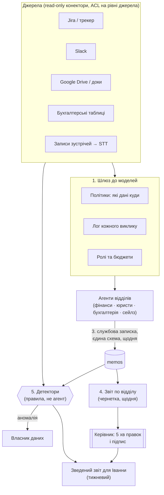

# 04 — Внутрішня система знань для операційного директора

> Матеріал для Частини B. Сам `PROCESS.md` пишеться окремо; тут — конструкція й аргументи.

## Рішення

**Проблема не в тому, що відділи користуються Claude по-різному. Проблема в тому, що результат їхньої роботи ніде не приземляється у машиночитаному вигляді.** Іванна керує фінансами, юристами, бухгалтерією і сейлзами; у кожного відділу свої «клоди» й агенти, свої таблиці, свої чати. Щотижневий звіт зараз — це людина, яка руками зшиває трекер задач, Slack і власні зустрічі за ~1 годину на тиждень на кожного керівника.

Порядок дій свідомо такий: **спершу шлюз (бо без нього немає ні логів, ні контролю), потім конектори, потім записки, потім звіти, і лише в кінці — детектори.** Найпоширеніша помилка — почати з красивого зведеного дашборда над даними, яких немає.

Ключове розмежування, яке проходить крізь усі п'ять етапів: **збирання і формулювання — агент; рішення і зобов'язання — людина.** Агент готує чернетку виплати; підписує людина.

---

## As-Is

```
Jira/трекер ─┐
Slack ───────┼──► керівник відділу (руками, ~1 год/тиждень) ──► звіт у довільній формі ──► Іванна
зустрічі ────┘                                                        (текст у чаті/доці)
                                                                             │
                                          зведення 4-6 звітів руками ────────┘  (+1-2 год)
```

Чому це ламається, крім витрати часу: формат у кожного свій, тому зведення неможливо порахувати; те, що керівник забув, зникає безслідно; дані про роботу є тільки в голові людини, яка звітує; і найдорожче — **зворотний звʼязок приходить через тиждень**, коли виправляти вже пізно.

## To-Be



---

## Етап 1. Централізований шлюз до моделей

Один HTTP-ендпоінт, через який ходять усі відділові агенти. Не для того, щоб «заборонити Claude», а щоб з'явилися три речі, яких зараз немає: лог, політика і бюджет.

| Що дає | Конкретика |
|---|---|
| **Лог** | кожен виклик: хто (людина+відділ), який агент, модель, промт-хеш, які інструменти, скільки токенів, скільки $, які джерела читав |
| **Політика даних** | класи `public / internal / confidential / regulated`. Правило вигляду «дані класу regulated (зарплати, персональні дані клієнтів) — тільки модель у європейському регіоні, без збереження, без навчання; вихід не логується дослівно, лише хеш» |
| **Ролі** | набір інструментів приходить із ролі викликача, а не з бажання агента (див. 02, allow-list). Юридичний агент не має доступу до платіжних інструментів навіть якщо його про це попросити |
| **Бюджет** | ліміт $/місяць на відділ; перевищення — не блок, а алерт Іванні: перевитрата зазвичай означає, що хтось знайшов цінний сценарій, а не зловживає |
| **Кеш і промт-кешинг** | одна точка = одна економія на всіх |

Міграція без насильства: шлюз сумісний з Anthropic API за формою запиту, тож перехід відділу — це заміна `base_url` і ключа. Хто не перейшов — видно в логу як «тіньове використання», і це предмет розмови, а не блокування.

## Етап 2. Конектори джерел з ACL

Read-only, кожен зі своїм маппінгом прав. Правило одне і жорстке: **ACL живе на рівні джерела, а не на рівні відповіді**. Тобто агент фізично не отримує рядок, до якого користувач не має доступу — не «отримує і фільтрує». Модель, яку попросили не показувати, показує; індекс, у якому рядка немає, показати не може.

| Джерело | Що беремо | Особливість |
|---|---|---|
| Jira/трекер | задачі, статуси, ворклоги, зміни статусів | єдине джерело, де є час; саме звідси кейс із зарплатою |
| Slack | публічні канали відділів | приватні DM — ні, і це продуктове рішення, не технічне обмеження |
| Google Drive | документи з позначених тек | версії важливіші за вміст: «змінено 3 доки політики» — уже сигнал |
| Бухгалтерські таблиці | іменовані діапазони, не «весь файл» | інакше ACL неможливий |
| Записи зустрічей | STT (Soniox) + діаризація + PII-редакція | конвеєр із документа 02, тир 4 |

Індексація — тим самим кодом, що й публічний корпус: чанкінг, ембеддинги, ledger фактів, стрипінг інструкцій, дедуп. Веб-специфічний тільки краулер; решта переноситься без змін.

## Етап 3. Службова записка

Найдешевша частина і найбільша зміна. Наприкінці робочого дня кожен відділовий агент лишає **одну структуровану записку** — не есе, а YAML із обовʼязковими полями:

```yaml
memo_id: fin-2026-09-12
department: finance
date: 2026-09-12
author_agent: finance-assistant@v3
done:
  - what: "Звірено вересневі виплати по 3 партнерах"
    refs: ["JIRA-FIN-812", "sheet:payouts!B14:F40"]
numbers:                      # тільки з інструментів, кожне з джерелом
  - key: payouts.pending.usd
    value: 184320.00
    source: "sheet:payouts!F41"
blockers:
  - what: "Немає підтвердження ставки кешбеку від Acme"
    blocking: ["JIRA-FIN-812"]
    since: 2026-09-09
    owner: "sales"            # блокер завжди має адресата
risks: []
needs_human:                  # те, що агент свідомо не вирішував
  - "Підпис на виплаті Acme"
tokens_used: 41200
cost_usd: 0.38
```

Три властивості, які роблять записку корисною: **єдина схема** (валідується, інакше не приймається), **кожне число з посиланням** (те саме правило, що в 02), **блокер має адресата** — блокер без власника не блокер, а скарга.

Записка — це фактично `daily-wrap`, який кандидат уже робить для себе: реконструкція дня з логів агентів, а не з памʼяті людини. Різниця лише в тому, що тут вона машиночитана.

## Етап 4. Автоматичні звіти

**Щодня — по відділу.** Агент читає записки свого відділу + діаграму змін у джерелах і формує чернетку. Керівник витрачає ~5 хвилин: правки й підпис. Підпис — це не формальність, а точка відповідальності: непідписаний звіт іде в зведення з поміткою «без перевірки людиною».

**Щотижня — зведений для Іванни.** Не конкатенація чотирьох звітів, а три блоки:
1. **Цифри** — таблиця ключових показників по відділах, кожне число клікабельне до першоджерела.
2. **Блокери між відділами** — те, чого не видно з одного відділу: блокер фінансів із власником «sales», який висить 4 дні.
3. **Що змінилось проти минулого тижня** — дельти, а не стан. Стан Іванна й так бачить у дашбордах.

Чернетка приходить у понеділок о 8:00; годину ручного зшивання замінює перегляд.

## Етап 5. Детектори аномалій — **правила, а не агент**

Кейс із голосової нотатки: **людина не затрекала час у Jira → зарплату неможливо порахувати**. Це не задача для агента. Це `SELECT`:

```sql
-- щодня о 19:00, по кожному співробітнику з активним контрактом
SELECT person, expected_hours - COALESCE(logged_hours, 0) AS gap
FROM worklog_daily
WHERE workday = :d AND gap > 2
```

Ескалація — теж правило, не судження:

| Час | Дія | Кому |
|---|---|---|
| день 1, 19:00 | нагадування | самій людині |
| день 3 | у щоденну записку відділу як `blockers[]` | керівнику |
| день 5 (перед розрахунком ЗП) | блок закриття періоду | бухгалтерії + Іванні |

Чому саме правило: детектор має бути **детермінованим, дешевим і поясненним**. «Агент подивиться, чи все гаразд із трекінгом» — це недетерміновано (сьогодні помітив, завтра ні), недешево (щоденний прохід по всіх людях) і непояснено (чому саме цих трьох підсвітив?). LLM тут доречний лише як **формулювальник**: правило знайшло розрив, модель пише людське речення в записку.

Той самий шаблон для інших детекторів: витрати відділу > бюджету; задача в «In Review» довше N днів; виплата без підпису; документ політики змінено без тікета; записка не надійшла (мовчання — теж сигнал, див. failure modes).

---

## Що НЕ має бути агентом

| Процес | Чому не агент | Що робить агент натомість |
|---|---|---|
| **Виплати й підтвердження платежів** | Незворотна дія з грішми. Ціна помилки — гроші назовні, і жоден eval не дає гарантії, потрібної для незворотної операції | Готує чернетку платіжки: суми з ledger, формула, посилання на джерело, перелік того, чого бракує. Підпис — людина |
| **Юридичні висновки** | Відповідальність несе людина з ліцензією; висновок LLM не має правового статусу, а звучить впевнено | Знаходить релевантні пункти договорів із цитатами й номерами розділів, складає перелік питань до юриста |
| **HR-рішення** (найм, звільнення, оцінка, ЗП) | Асиметрія влади, регуляторний ризик (GDPR, дискримінація), і головне — ці рішення мають бути пояснені людині людиною | Збирає фактуру: ворклоги, закриті задачі, дати. Жодних оцінок і рейтингів |
| **Комунікація з клієнтом від імені компанії** | Сказане в переговорах на мільярди стає зобовʼязанням | Готує чернетку з підтягнутими цифрами й позначкою, які з них `hedged` |
| **Детектори аномалій** | Мають бути детермінованими й відтворюваними (див. етап 5) | Формулює знайдене людською мовою |
| **Зміна прав доступу** | Агент, що може розширити собі доступ, — це не система безпеки | Пропонує зміну як тікет |

Спільний критерій: **якщо дію не можна відкотити або вона створює зобовʼязання перед третьою стороною — агент готує, людина ухвалює.**

---

## Метрики успіху

Три, усі вимірювані з логів, без опитувань:

1. **Час керівника на звіт** — з ~60 хв/тиждень до **≤10 хв** (вимірюється як час між відкриттям чернетки й підписом; є в логу шлюзу). Ціль на 8-й тиждень: медіана ≤10 хв по всіх відділах.
2. **Повнота даних на момент звіту** — частка обовʼязкових полів записки, заповнених із джерел, а не «—». Ціль ≥90%. Ця метрика ловить головний спосіб провалу: звіти стали швидкими, бо стали порожніми.
3. **Час до виявлення аномалії** — медіана від настання умови (напр. не затрековано > 2 год) до нотифікації власнику. Ціль **< 24 год** проти теперішнього «зʼясовується в день розрахунку ЗП». Похідна метрика, за яку насправді платять: кількість періодів ЗП, закритих із розривом у ворклогах — ціль 0.

Свідомо **не** метрика: «кількість запитів до агентів» і «зекономлені токени» — обидві ростуть від безглуздої активності.

---

## Failure modes і як їх помітити раніше за скаргу

| Відмова | Як виглядає | Детектор (працює до скарги) | Що робиться |
|---|---|---|---|
| **Конектор мовчки віддає порожнє** (протух токен, змінився ACL) | звіт правдоподібний, але без половини даних | heartbeat: кожне джерело має віддати ≥1 рядок за 24 год; нуль = алерт | звіт виходить із банером «дані Jira недоступні з 09-10», а не без них |
| **Записка не надійшла** | відділ зникає зі зведення | обовʼязковий список відділів; відсутня записка = явний рядок «немає даних» | зведений звіт ніколи не виглядає повним, коли він неповний |
| **Цифра без джерела** | число у звіті, якого немає в жодному інструменті | схема записки не приймає `numbers[]` без `source`; gate 3 із документа 02 | запис відхиляється на етапі валідації |
| **Дрейф якості** | резюме стають розмитими після зміни моделі | щотижневий golden set із 10 записок з еталонним витягом; strict accuracy | відкат моделі; `config_sha256` показує, що змінилось |
| **Витік між відділами** | сейлз бачить дані ЗП | canary-рядок у кожному захищеному джерелі + щоденний тест «роль X питає про Y» | інцидент, ротація доступів, розбір |
| **Тіньове використання** | відділ ходить повз шлюз | звірка витрат на корпоративних ключах провайдера з витратами шлюзу | розмова, а не блок: зазвичай означає, що шлюзу чогось бракує |
| **Автоматизація узаконила поганий процес** | усі метрики зелені, користі нема | щоквартально: частка звітів, які хтось відкрив і на які хтось відреагував | звіт, який ніхто не читає, скасовується |

Останній рядок — найважливіший. Найгірший результат такого проєкту не «зламалось», а «працює й нікому не потрібно».

---

## Що показати на демо

1. **Одна записка наскрізь**: агент фінансів → YAML → валідатор відхиляє число без `source` → виправлена записка → чернетка звіту → підпис.
2. **Кейс із зарплатою наживо**: видалити ворклог у тестовій Jira → через хвилину детектор (SQL, видно на екрані) знаходить розрив → нагадування людині → на 3-й день той самий розрив уже в `blockers[]` записки відділу.
3. **ACL по-справжньому**: те саме питання «які виплати заплановані» від ролі `sales` і від ролі `finance` — різні відповіді, і в трасі видно, що ретрівер повернув різну кількість рядків, а не що модель «вирішила не казати».
4. **Зведений звіт для Іванни**: клік по числу → першоджерело (комірка таблиці / тікет / хвилина запису зустрічі).
5. **Лог шлюзу за день**: хто, який відділ, скільки коштувало, які джерела читав — одна таблиця, яка сьогодні не існує ніде.
6. **Свідома межа**: показати чернетку платіжки з полем «підпис: —» і те, що система не має інструмента, який цей підпис ставить.
