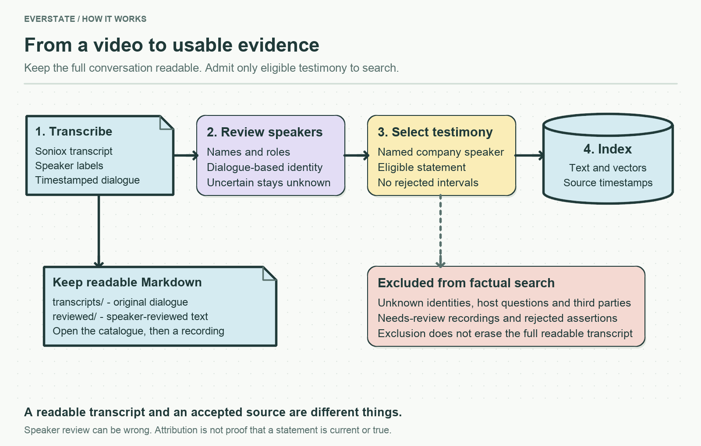

# YouTube: read a transcript, then follow the evidence

**[Browse the 18 reviewed Markdown transcripts](../../artifacts/youtube/reviewed/README.md).** Each file contains the full dialogue, named or explicitly unknown speakers, recording-time roles and links to timestamps in the video. You can read it directly on GitHub.

The assignment treats video as a separate category because transcription has a cost. We keep the complete conversation available for inspection, but admit only supported company testimony to search. A readable transcript and accepted factual evidence are different things.

## Start with one example

Open [Bohdan Opryshko's April 2026 interview](../../artifacts/youtube/reviewed/2026-04-23-coo-opryshko-bohdan-crypto-market-recovery-ukraine-lessons-and-staking-resilience-bohdan-opryshko-on-geopolitics--d8EtzF2qhMM.md). Read its speaker table, follow a timestamp, then compare it with the [original anonymous transcript](../../artifacts/youtube/transcripts/d8EtzF2qhMM.md). The spoken text is retained; the review adds attribution and decides which turns can be used as evidence.

| Location | Why it exists | Do I need to read it? |
| --- | --- | --- |
| [artifacts/youtube](../../artifacts/youtube/README.md) | Saved transcripts, selection records and review results. | Yes, to inspect actual video material. |
| [src/services/youtube](../../src/services/youtube/README.md) | Code that retrieves, transcribes, reviews and imports videos. | Yes, to explain or change the implementation. |
| [assistant/config/youtube.yaml](../../assistant/config/youtube.yaml) | Video selection and processing settings. | When changing what is collected. |
| [assistant/prompts/speaker-review.md](../../assistant/prompts/speaker-review.md) | The actual instructions sent to the speaker-review model. | When inspecting how attribution is requested. |
| [assistant/skills/evidence.md](../../assistant/skills/evidence.md) | Reusable evidence guidance for the answer researcher. | When inspecting how answers compare sources. |
| [artifacts/costs/YouTube](../../artifacts/costs/YouTube/README.md) | Saved usage and processing cost records. | To check the cost-versus-value trade-off. |

“Skills” here means Markdown guidance used by the answer researcher. Transcripts are source material and live in `artifacts/youtube`; they are not model instructions.

## What can enter search

1. **Transcribe.** Soniox preserves timestamps and anonymous speaker labels. Those labels alone do not identify people.
2. **Review.** Gemini reviews the complete dialogue for identities, recording-time roles, affiliation, label consistency and non-evidence turns. Dialogue must support the identity; metadata alone cannot map a name to a speaker label.
3. **Select testimony.** Only named company participants' eligible turns from reviewed recordings enter the evidence export. Unknown speakers, interviewer and third-party turns, questions, hypothetical or quoted assertions, retractions and suspicious intervals are excluded. A mixed turn can be excluded in full.
4. **Index.** Each passage repeats the recording timestamp, speaker and role. Citations seek to the relevant video time. Source authority does not prove a claim true: recency, conflicts and ordinary evidence validation still apply.

Text-only attribution is imperfect and is not an acoustic identity guarantee. A `needs_review` recording remains readable but stays outside the factual index. [Attribution QA](ATTRIBUTION_QA.md) explains known limitations and corrections.

## Saved outputs and repeatable work

The [artifact index](../../artifacts/youtube/README.md) links to full dialogue, raw exports and machine-readable manifests. Display filenames use upload date, recording-time role, speaker name, topic and the stable video ID. Unknown names and roles remain explicit.

Local `data/youtube/<video-id>.job.json` files cache Soniox jobs; `<video-id>.review-v2.json` files cache model reviews. These mutable caches are not submitted to Git. Display changes reuse existing transcripts rather than retranscribing audio. The [operations guide](../OPERATIONS.md) documents processing commands; review calls can incur API cost.

Activation prepares all YouTube chunks and embeddings before replacing the active YouTube documents. If embedding fails, the previous source remains active and the failed call remains in the cost ledger. Other corpus sources are retained. The frozen twenty-question evaluation is not automatically re-certified by a later video update.

## Saved deployment snapshot — 13 September 2026

18 readable reviews; 6 eligible source documents with 189 embedding passages. Ten recordings remain `needs_review`; two reviewed recordings have no eligible named company testimony. That deployed corpus retained 935 non-YouTube documents (941 total). The recorded server check passed 117 tests at that time. A live CCN question returned an attributed answer and a source link at 4:12; repeated activation reused all embeddings without additional calls. [Saved smoke test](../../artifacts/youtube/reviewed/live-smoke-test.json).

Display names use **upload date → recording-time role → surname and given name → original topic/title**. For example: `2026-04-23 — COO — Opryshko Bohdan — …`. Stable YouTube IDs stay at the end of filenames. Unconfirmed roles are explicitly marked; raw video titles and original transcript text remain preserved inside the export. The same names are published in Git and in source-card titles.
