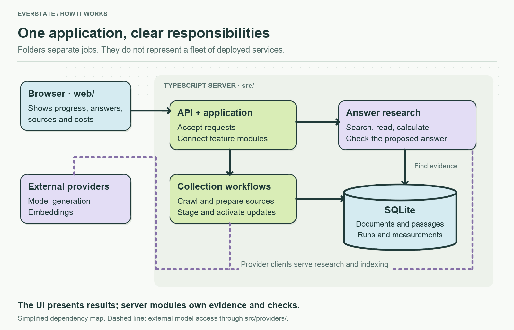

# Server application

The TypeScript server exposes the API, runs research and collection work, and stores evidence in SQLite. Entry points and shared contracts sit here; focused modules hold the actual behavior.

Start with `application.ts` for wiring, [services](services/README.md) for features, and [workflows](workflows/README.md) for collection orchestration. These are modules in one application, not separately deployed services.

Read the entrypoints in this order:

1. `main.ts` opens the database, builds the application, and starts HTTP.
2. `application.ts` connects the model, retrieval, accounting, and update services. `executeSourceUpdate()` is the same queue operation for manual and scheduled updates.
3. `api.ts` validates HTTP input and streams actual progress events; it delegates research to `application.ask()`.
4. `cli.ts` has a short command switch in `runCommand()`. Longer operations have named functions below it: `crawlSelectedSources()` and `indexCollectedDocuments()`. CLI failures set a nonzero exit status and always close the database.
5. `contracts.ts` describes the objects crossing these boundaries: snapshots, passages, claims, checks, receipts, and events.

The API tests use controlled services, and `cli.test.ts` runs the real CLI against an in-memory database with no provider keys. Detailed evidence logic and its regressions live beside the relevant [service](services/README.md).

