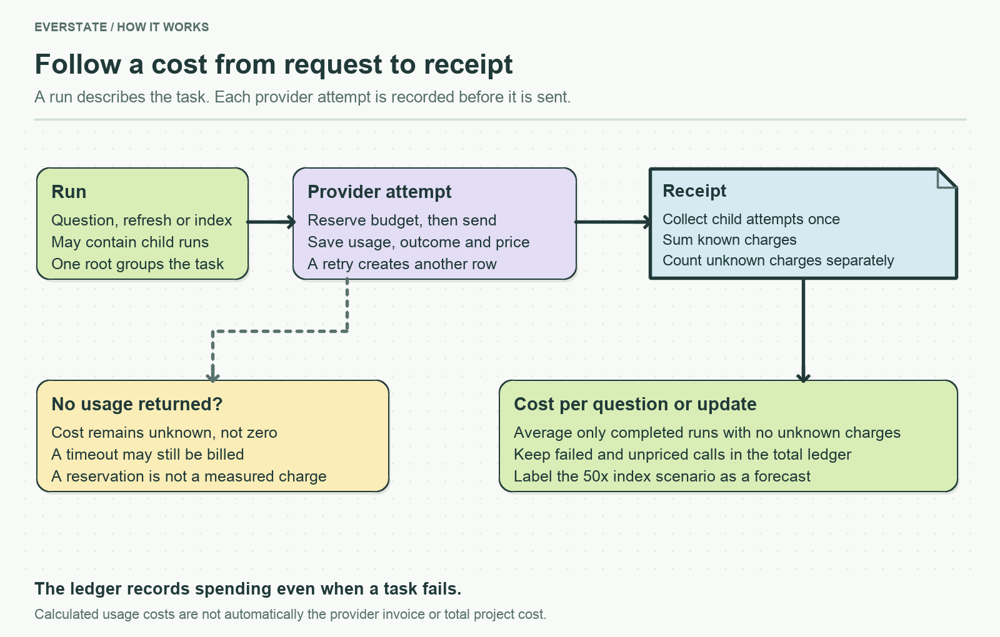

# Model-provider clients

Start with `model-client.ts`. It exposes `generate()` for Gemini and `embed()` for OpenAI. Feature modules use these methods without knowing the provider's HTTP format.

| File | Responsibility |
| --- | --- |
| `model-client.ts` | Send a generation or embedding request, parse the response, and return the application's shared response shape. |
| `metered-request.ts` | Reserve a budget, run each attempt with a timeout, record usage, and decide whether to retry. |
| `gemini.ts` | Translate generation messages and responses for the native Gemini API. |
| `openai.ts` | Translate OpenAI-compatible generation and embedding messages and responses. |
| `provider-config.ts` | Read model choices, prices, credentials, and endpoint settings. |

## Follow one request

1. The client chooses the configured model and provider format.
2. The attempt runner reserves budget **before** sending any request.
3. The client sends HTTP and parses both the answer and the provider's token counts.
4. The runner saves that attempt's outcome and usage, even when the answer is unusable.
5. A temporary failure may start another attempt. Each retry has its own accounting row, linked by the same operation ID.

A timeout does not prove the provider did no work. If no usage came back, its cost stays **unknown**, rather than becoming zero. The budget reservation is only a safety allowance; it is never presented as measured spending.

Caller cancellation and timeouts share a fetch abort signal, but are recorded separately. Cancellation stops retries. Timeouts, network failures, HTTP 408, HTTP 429, and server errors may retry, up to the configured limit. Cancellation during the retry delay is checked before another attempt starts.

Model choices live in [config](../../assistant/config/README.md). Change transport details here; evidence selection and answer validation belong to the calling services. `model-client.test.ts` uses fake HTTP responses to check retries, cancellation, and accounting without paid calls.

