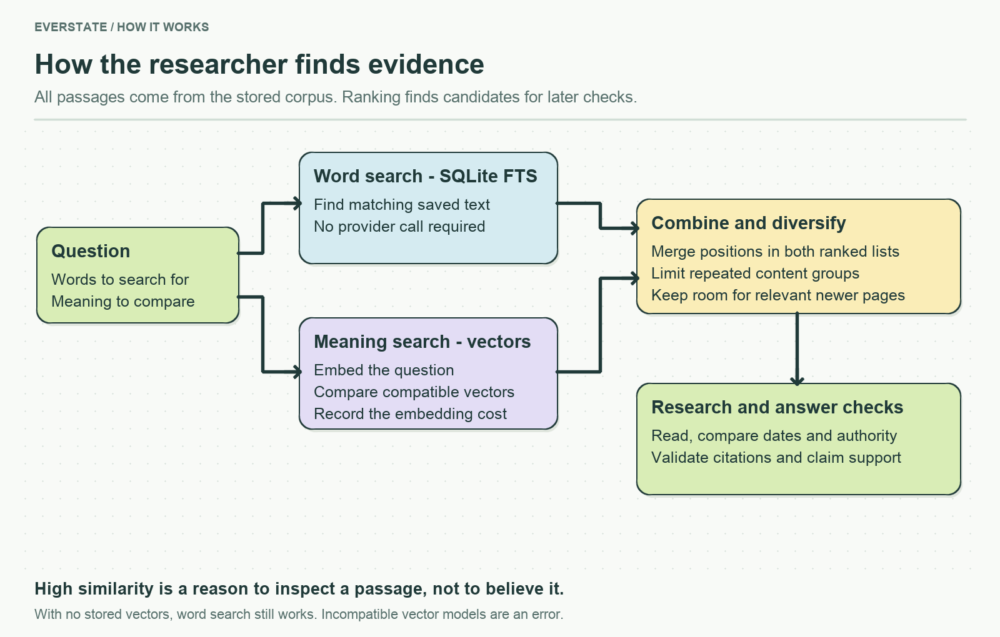

# Search and read evidence

Search combines lexical matching and embeddings to find useful passages in the collected corpus. Read operations return source-linked text for the researcher to inspect.

Search rank is a discovery aid, not a verdict on truth. The [answer module](../answer/README.md) still has to consider source authority, dates, and conflicting evidence.

[search-corpus.ts](search-corpus.ts) owns lexical discovery and reading sanitized indexed passages. `readDocument` searches within the whole document when a query is provided and returns a four-passage window with a continuation offset. It never fetches live text.

[hybrid-search.ts](hybrid-search.ts) indexes in bounded batches, compares compatible embedding vectors, fuses lexical and semantic ranks, and limits repeated content groups. A quarter of result slots is reserved for newer dated candidates that already rank near the result window. This exposes time changes for evidence comparison; it does not declare newer pages universally true.

Indexing and query embedding use `assistant/config/models.yaml`'s embedding model. Stored vectors are checked for finite values and a consistent dimension, and provider responses must match the requested model and dimensions. A model change needs a rebuilt index; an error is never turned into an evidence-based “no reliable answer”. No embeddings at all permits a lexical-only fallback without a provider call.
