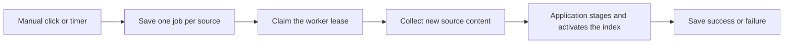

# Updating the corpus

This folder decides **when to check sources again** and remembers the result of each check. It does not answer questions. [The application](../../application.ts) connects the queue to web crawling, video processing and the final index update.



Read [controller.ts](controller.ts) first. `enqueue` saves requests; `startBatch` groups the jobs shown together in the UI. `tick` checks for work, claims the queue, renews its lease and runs one job. `executeJob` records progress and the final result. A **lease** is a token with an expiry time in SQLite: it prevents two application processes from running the queue at once. A crashed worker's unfinished job becomes `interrupted` after the lease expires.

| File | What it does | Change it when… |
| --- | --- | --- |
| [controller.ts](controller.ts) | Persists jobs, avoids duplicate requests and runs one source at a time. | Changing queue, retry or batch behavior. |
| [settings.ts](settings.ts) | Validates enabled sources, intervals, priorities and the video limit. | Changing when or how often sources run. Priority affects queue order, not source authority. |
| [discover-videos.ts](discover-videos.ts) | Finds video IDs and checks their metadata before audio is downloaded. | Changing where new videos are discovered. |
| [refresh-videos.ts](refresh-videos.ts) | Skips old IDs, processes a bounded set of pending videos and saves each result. | Changing how new videos enter the existing [YouTube pipeline](../youtube/README.md). |
| [controller.test.ts](controller.test.ts) | Checks duplicate clicks, two workers, restart, scheduling and batch retries. | Verifying changes to job execution. |
| [refresh-videos.test.ts](refresh-videos.test.ts) | Checks that old videos are skipped and failed processing stays retryable. | Verifying video update behavior. |
| [api.test.ts](api.test.ts) | Checks accepted requests and rejection of unsafe cross-origin writes. | Verifying update HTTP routes. |

Video processing and corpus activation are separate steps. Completed transcripts and speaker reviews stay cached if a later step fails. A ready video is returned again on the next pass so activation can retry without buying another transcription. `createTranscriptionMeter` records Soniox attempts and budget reservations; unknown provider billing stays unknown.

Automatic updates start disabled. Pausing them leaves scheduled jobs in the queue; a manual click can still run that source. `stop()` stops the polling timer, not an already running job. See [the operating contract](../../../docs/UPDATES.md) for deployment and scope limits.

Run the local checks without provider calls:

```sh
npx tsx --test --test-concurrency=1 src/services/updates/*.test.ts
```
