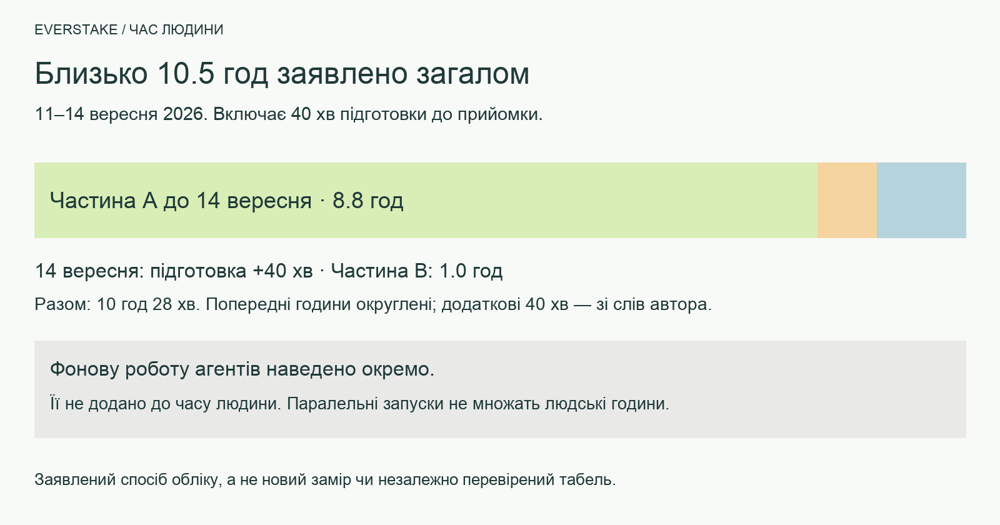

# Тестове Everstake: мій час і робота агентів

> **ENGLISH VERSION: [TIMELOG](../TIMELOG.md) · [УКРАЇНСЬКІ ДОКУМЕНТИ](README.md) · [ДЕМО ПРОДУКТУ](https://everstate-knowledge-base.89-167-19-222.sslip.io/)**

> **Заявлений час, а не замір секундоміром.** Історичні підсумки й округлення за 11–13 вересня збережено. 14 вересня автор додав **40 хвилин** за ранок на підготовку репозиторію й тестового до прийомки. Частина A тепер становить **9 год 28 хв** (8.8 год + 40 хв); разом із частиною B — **10 год 28 хв (приблизно 10.5 год)**. Початкові 8.8 год округлені, тому підсумки в хвилинах показують арифметику, а не точність вимірювання до хвилини. Результати в хронології описують стан на той момент; актуальні результати — в [EVAL](EVAL.md). Раніший [підрахунок за подіями](../docs/TIME.md) перетинається із цим ретроспективним обліком, тому додавати його не слід.

Я намагався вкластися у 8 годин, хоча по факту витратив трохи більше. Багато роботи при цьому робили агенти на фоні: я давав задачу, і вони кілька годин працювали самі. Час роботи агентів я не рахував. Вихідні в мене були досить активні, тому до тестового я підходив кусками: часто давав задачу агенту і повертався через пару годин перевірити роботу.

## Як це працює в мене

У своїй компанії я налаштував систему, яка автоматично трекає мій час і те, що я робив. Для нашого відділу девелоперів вона працює так. Наприкінці робочого дня запускаю скіл, який збирає звіт. Основне джерело - голосовий застосунок, що перетворює голос на текст і зберігає записи з датою та часом. За ними видно, які задачі я ставив протягом дня. Claude Code і Codex після задачі записують у changelog, що й коли зробили, з точки зору бізнес-задачі. Скіл зіставляє ці записи: що просив і що зроблено.
Цей документ зібраний тим самим способом: з моїх голосових диктовок і промптів у Claude Code та Codex. Зазвичай я відправляю форматований звіт, але тут вирішив показати сирі промпти, щоб було видно, які саме задачі я ставив.

> **Як пораховано мій час.** За таймстемпами моїх промптів і диктовок у Claude Code і Codex. Промпти з паузою до 10 хвилин рахуються одним блоком, від першого до останнього. Одиночний промпт іде як 5 хвилин. До виміряного додано час, коли я читав результати агентів і перевіряв стенд між промптами. Час, коли агенти працювали самі, а мене не було за компом, у суму не входить і показаний окремо сірим.
>
> **Формат пунктів.** *Курсивом* мої промпти, як я їх диктував (скорочено). Після стрілки → що з цього вийшло.

| День | Мій час | Агенти на фоні |
|---|---|---|
| П'ятниця 11.09 | 1.5 год | ~7.5 год: перша версія, Codex-версія, агентний шар |
| Субота 12.09 | 2.5 год | ~3 год: читабельність коду, витрати, свіжість, Trust Score |
| Неділя 13.09 | 4.1 год | ~2 год: нова версія за планом |
| Неділя 13.09, фікси й облік часу (21:00–22:45) | 0.75 год | |
| Частина A, історичний підсумок (11–13.09) | 8.8 год | |
| Понеділок 14.09, ранок: підготовка до прийомки | 40 хв | Не виміряно |
| **Частина A, разом із підготовкою** | **9 год 28 хв** | |
| Частина B (13.09, 21:00–22:45) | 1.0 год | |
| **Разом, включно з 14.09** | **10 год 28 хв (~10.5 год)** | |

## П'ятниця, 11.09 · 1.5 год

17:04 отримав завдання від HR. Дедлайн 16.09.

### 19:21–20:09 · 42 хв · Завдання, дослідження, план

- *«Візьми два файли з Telegram, збережи в папку docs, Test Assignment переклади на українську слово в слово, з усім жирним текстом, поруч окремим файлом. Потім проаналізуй задачу і скажи, як, на твою думку, її краще робити»* → завдання й 60 стартових URL у репо, переклад українською дослівно, перші думки по архітектурі
- *«Розпиши пайплайн простою мовою, щоб я розумів кожен крок»* → пояснення краулу, дедуплікації, індексу, фактів
- *«Різати відео не треба: можна знайти на YouTube відео про Everstake, дістати з усіх транскрипти і сформувати базу, бажано автоматичним пайплайном»* → YouTube-субтитри замість розпізнавання
- *«Скачай ai-info і MCP, подивись і скажи простою мовою»* → знайшли пастку з CEO: у пресі Кініцкий, на сайті Васильчук
- *«Підключи їхній MCP, потестимо, і подивись, скільки він жре пам'яті й токенів»* → 27 живих мереж проти «130+» у профілі, ~1.7k токенів на запит
- *«Я б робив не MCP, а API плюс skill для Claude Code»* → рішення: API + фронт
- *«Для чого їм цей MCP, яка з нього користь компанії?»* → розбір, де MCP сильний, а де ні
- *«Чи варто брати їхній MCP як джерело, якщо в завданні натякають, що він працює не дуже? І для кого він: для клієнтів чи для співробітників?»* → MCP лише для живих цифр, не основне джерело
- *«Під API в мене є каркас з попереднього проєкту на TypeScript; дай окремому агенту знайти його і оцінити, чи підходить. Робимо все на TypeScript, бо це моя рідна мова і мені легше пояснювати. Деплоїмо на мій сервер через sslip, щоб працювало не тільки на компі»* → каркас оцінили й відмовились, узяли лише схему деплою; стек TypeScript
- *«Архітектурно мені подобається. Тепер у якому вигляді це показати: в ідеалі не демо, а система, яку можна їм віддати, бо в них та сама проблема, тільки даних у мільйон разів більше. Всередині живе модель, і коли питаєш, хто CEO, вона видає source. І треба вкластися в 5-6 годин, щоб потім не дебажити половину часу. Що порадиш?»* → вимоги до продукту в план
- *«Запусти окремого агента, поясни йому детально задачу»* → огляд усіх 60 сайтів: robots, sitemap, биті дані
- *«Твоє завдання: ще раз детально прочитати завдання і продумати всю систему, кожен етап, крім частини B про облік часу. Продумай усі верифікації, про які вони пишуть, і всі пункти меню. Напиши детальний план, інтуїтивно зрозумілий. Потім зроби каркас і реалізуй усю систему під ключ, разом з тестами. Роби ставку на те, щоб усе було зрозуміло. Я повернуся і порівняю з цим рішенням»* → детальний план, після нього Claude Code почав будувати першу версію

> **Агенти на фоні, 20:20–22:45.** Claude Code зібрав першу версію й задеплоїв. З 22:00 Codex незалежно будував другу для порівняння.

### 20:59–22:41 · 15 хв · Три короткі перевірки

- *«Знайди мій Gemini API ключ і перебудуй систему на Gemini, не пали багато коштів. Потім перечитай завдання і перевір, чи всі пункти виконані правильно, чи evaluation виконаний, і зроби дизайн класнішим»* → перший eval, питання про CEO спершу неправильне → правило «діє жива сторінка на дату збору»
- скінчились кредити Claude → перевів відповіді на Gemini
- *«Напиши, в чому ідея дизайну, я дам це Claude Design, хай він продумає»* → бриф на дизайн інтерфейсу
- *«Створи GitHub-репозиторій і клади туди зміни по часу, це є у вимогах. Веди changelog: коли прийшло завдання, скільки я читав вимоги, коли запустив Claude під ключ. Поточний результат задеплой і поклади в окрему папку claude-work»* → репозиторій і хронологія роботи
- *«Тепер, знаючи всі ці штуки, запусти ще GPT-5.6 і дай йому завдання зробити все під ключ і задеплоїти на мій сервер. Точних інструкцій не давай, щоб він зробив по-своєму, і порівняємо»* → дві системи будуються окремо, для порівняння
- модель відповідей → `gemini-3.8-flash`

> **Агенти на фоні, 22:45–03:56.** Агентний шар: модель сама обирає інструменти (пошук, історія фактів, живий fetch, MCP), кроки видно наживо, перевірка чисел за джерелами, набір атак 16 pass / 0 fail.

## Субота, 12.09 · 2.5 год

> **Агенти на фоні, 12:45–13:32.** Спершу страхувальні тести (26 → 147 TS, 16 → 283 Python), потім переписано обидві версії. Знайдено й виправлено розбіжність 75% / 80% між демо і звітом.

### 15:20–16:05 · 23 хв · Як система працює і що міряємо

- *«Поясни кожен етап детально: що ми міряємо, чи це реальні заміри, чи приблизні, чи точні токени»* → розбір вимірювань
- *«Ніде не використовуємо Gemini 2.5, тільки 3.8 Flash і Flash Lite»* → всюди моделі 3.x
- *«Хай Claude і Codex кожен зробить свою оцінку якості, і окрема менюшка на фронті»* → сторінка результатів оцінки
- *«У вимогах 60 сторінок, а хочуть мінімум 200; YouTube на наш розсуд»* → бриф на розширення джерел

> **Агенти на фоні, 15:26–17:44.** Облік витрат по етапах і питаннях, політика свіжості джерел, спікери в джерелах і Trust Score у Codex-версії.

### 16:33–18:06 · 93 хв · Правки по стендах і підготовка захисту

- *«Стенди подають відповідь сирим markdown, зроби форматовано в обох»* → форматування з екрануванням, бо текст зі сторонніх сайтів = шлях ін'єкції
- *«У verify evidence 3 sources, а це одна й та сама сторінка, розберись»* → одна картка на сторінку
- *«Дамо обом агентам завдання зробити скор: наскільки можна довіряти відповіді»* → Trust Score з поясненням складових
- *«Канал Everstake на YouTube це просто музика, а ми його парсимо»* → нерелевантні відео відсіюються
- *«Досліди, як запобігти prompt injection, і допишемо в захист і демо»* → розділ про захист від ін'єкцій
- *«Evidence ненаочний: незрозуміло, що аналізували і як судили»* → бриф на наочні докази в обох версіях
- *«Опиши проєкт для агентів; для демо пишемо DEFENCE.md українською, простими тезами»* → гайд проєкту, тези захисту, сценарій демо
- *«Скільки приносить стейкінг ETH в Everstake?»* → перевірка стенду живими питаннями
- *«Як ми захищаємось від дублікатів?»* → пояснення групування копій однієї сторінки
- *«У завданні питають, як ми даємо раду брудним і неузгодженим даним, як міряємо якість, як ухвалюємо рішення, як реагуємо на зміну вимог; підготуй відповіді»* → відповіді в тезах захисту
- *«Підготуймо демо: презентація через Claude Design і сценарій, як система працює»* → сценарій демо
- *«Тут правило "максимум 6 кроків": чому саме 6, може, варто більше?»* → пояснення ліміту кроків агента
- *«Документи для захисту й для людей пиши людською мовою: коротко, без води, краще менше речень, але влучних»* → правило стилю для документації
- *«Пройдись по кожному пункту завдання і по коду обох версій»* → критичний аудит проти вимог
- облік часу: чесна цифра замість «7–8 годин» за тривалістю сесій

### Підготовка до захисту · не входить у підрахунок

- після того як базовий агент був готовий, я за допомогою свого Telegram-бота згенерував аудіоверсії пояснень до кожного розділу системи і слухав їх на прогулянці, щоб підготуватися захищати демо

## Неділя, 13.09 · 4.1 год

### 14:40–15:33 · 53 хв · План перебудови

#### Що беремо в нову версію

- *«У версії Клода класно показуються джерела з цифрами, а в Codex гарно видно, як вона шукає»* → нова версія бере обидва
- *«Пройдись по вимогах до тестового по всіх пунктах і випиши всі фічі обох версій»* → повний список фіч і прогалин
- *«Вони хотіли бачити таймлайн: біля джерела має бути видно, як факт змінювався»* → таймлайн фактів у план
- *«Система має бути живою: не натиснув кнопку і через 25 секунд глуха відповідь. У Claude класний таймер, у Codex видно, які джерела беремо і чому»* → живий показ пошуку в плані
- *«Система не має бути заточена під питання про CEO; ось еталонна відповідь, розберись, щоб працювало загалом»* → жодних підгонок під конкретні питання
- *«Відкриваєш GitHub і вже зі структури папок усе зрозуміло, щоб я міг пояснити код блоками»* → структура репо під пояснення
- *«Стаття написана у квітні 2025, потім переїхала на новий домен; дата має лишитись оригінальною»* → правило дат джерел
- *«Вони точно запитають, як система реагує, якщо прямо зараз додати дані»* → сценарій оновлення даних у план

#### Оцінка якості й витрати

- *«Evaluation беремо зі складних питань, які ми вже робили, і використовуємо ще й як тест системи»* → еталонний набір
- *«На фронтенді красиво показати evaluation: під кожним питанням розписати, в чому його складність»* → сторінка оцінки з поясненнями
- *«Не 40 питань, забагато грошей; загальний список з 20»* → 20 питань
- *«Хочу бачити, скільки грошей з'їдає кожна відповідь і скільки всього витрачено, окремою таблицею»* → облік вартості кожної відповіді

#### База й YouTube

- *«Першу базу готуємо агентами Codex, а оновлення бази вже кодом»* → двоетапна підготовка даних
- *«Зібрати якомога більше джерел, не просто 200+»* → повна база
- *«Найімовірніше, додаткове завдання буде "додали нові дані": система має адаптуватись сама, а я можу доправити й передеплоїти»* → оновлення даних закладено в архітектуру
- *«В мене є свій пайплайн для YouTube, логічно його використати»* → YouTube через Soniox з розпізнаванням спікерів
- *«YouTube не завжди джерело третього порядку: для історії компанії й розвитку це може бути джерело другого, а то й першого порядку»* → вага відео залежить від типу питання
- *«Gemini має за контекстом визначити роль спікера: "у нас в гостях COO Богдан Опришко"; і перевірити, що спікери не переплутались»* → перевірка ролей, закладено у витрати
- *«YouTube розпиши окремим детальним підпланом, а в основний план дай посилання»* → окремий план по відео

#### Репозиторій і виконання

- *«Git-репозиторій це наше лице: все в main, дві версії, README не пояснює структуру»* → план: прототипи в окрему гілку, нова версія в `dev`
- *«План великий, розбий на точні шматки, щоб їх робили різні саб-агенти у worktree»* → пакети задач для паралельної роботи
- *«Головне не обрізати деталі плану при розбитті на частини»*
- *«Деплой на мій сервер через sslip, назва Everstake Knowledge Base»* → адреса стенду в плані
- *«Один AGENTS.md на проєкт, де написано, що ми робимо тестове»* → єдиний гайд для агентів
- *«Простіші задачі на одну модель, складні й фронтенд на сильнішу»* → розподіл агентів
- *«Ти оркестратор: йди по плану, перевір, протестуй, проведи evaluation, не витрачай багато грошей»* → старт виконання

> **Агенти на фоні, 15:35–17:46.** Нова TypeScript-версія: SQLite, журнал витрат, 20-кейсовий eval, гібридний пошук, безпечний краулер, атомарне оновлення бази, YouTube з таймкодами, інтерфейс. Прототипи прибрано, живе демо.

### 17:31–17:46 · 15 хв · Перевірка стенду з телефона

- *«Розберись, чи агенти Codex виконали план повністю: структура, реалізація, що зроблено, а що ні»* → звірка плану з кодом
- *«На телефоні питаєш, і далі дуже довгий список, а відповідь аж у кінці, треба гортати»* → відповідь зверху
- *«Вкладення у вкладенні у вкладенні, через це смужка тексту вузька»* → простіша структура відповіді
- *«Кнопка "Стоп" не працює: зупинив запит, задав нове питання, а мені помилка, що запит ще в процесі»* → скасування запиту виправлено

> **Агенти на фоні, 17:46–18:30.** Перевірка актуальності й обсягу тверджень, повторний eval: агент 19/20 проти baseline 11/20.

### 18:00–21:00 · 3 год · Основна кодингова сесія вдома

#### Джерела й дані

- *«Визнач, які відео нам підходять, дай список URL і відкрий у браузері»* → 12 відео: спершу свіжі, потім історичні
- *«Транскрипція через Soniox. Історія й позиціювання можуть погано лягти на ембединги, бо в питанні не буде слова "позиціювання"; може, окремим блоком?»* → відео як окреме джерело контексту, не лише фактів
- *«Обов'язково порахуй у витратах, скільки Soniox бере за обробку відео»* → транскрипція у звіті витрат
- *«У нас "спікер 1", "спікер 2", але ми не знаємо, хто це»* → імена й ролі визначаються за контекстом розмови
- *«Ведучий каже "ви підтримуєте 2000 блокчейнів", а COO відповідає "насправді 130"; не можна, щоб слова ведучого стали фактом»* → у корпус ідуть лише перевірені свідчення працівників Everstake, питання ведучих і хибні передумови відкидаються
- *«Назви відео: спочатку дата, потім посада, прізвище й ім'я, потім тема, і так само на GitHub»* → 18 транскриптів з людськими назвами
- *«На цьому питанні модель помилилась: у них 35 мереж активно і 130 за весь час. Без локальних затичок, розберись, чому система відпрацювала неправильно»* → кожне твердження несе свою дату і тип обсягу (поточний чи накопичений)
- *«Саме для стейкінгу, а не загалом, скільки мереж підтримують»* → уточнення змісту питання
- *«У завданні сказано: давати посилання на джерело і дату, коли новину опублікували, і писати це у відповіді»* → дати джерел у відповідях
- *«Оновлення даних має бути окремим пунктом меню: автоматично з частотою в налаштуваннях і кнопкою "оновити", і воно не має перетерти наявні дані»* → розділ Updates з безпечним оновленням
- *«Розділ Updates незрозумілий: що з ним робити і як ним користуватись, перепродумай»*
- *«Я очікував велику кнопку "Оновити": натискаєш, іде прогін, і видно візуалізацію оновлення»* → кнопка оновлення з прогресом

#### Якість відповідей і безпека

- *«Придумаймо нестандартні складні питання, покроули сайти нормально»* → нові важкі кейси
- *«Досліди, чому система не впоралась. Не описуємо часткові випадки, покращуємо систему в цілому»* → повторний тест: система прямо називає нерозв'язану розбіжність замість вигаданого пояснення
- *«Нові питання додай у розділ Evaluation, а менш цікаві заміни; питання про CEO залиш»* → оновлений набір складних питань
- *«На новій гілці main: чи нормально опрацьовується prompt injection? Проведи аудит»* → архітектура правильна (отруєний текст вирізається ще при збиранні), детектор треба посилити
- *«Якщо ці фікси ще актуальні на оновленій гілці, внеси їх, щоб система не ловила prompt injection, і задеплой»* → посилений захист від ін'єкцій

#### README

- *«Потрібен якісний README без води, по секціях, з візуалізаціями, як у моєму репо LiquidityScan; схеми намалюй через OpenCV»* → README зі схемами
- *«Дивлюсь dev, а коміта з README там нема, розберись»* → README опубліковано в dev і main
- *«README має показувати, яку роботу я зробив, і пояснювати кожну частину, наприклад, як захищаємось від prompt injection»*
- *«Схеми гарні, але людина зі сторони нічого не зрозуміє, спрости. І зроби український README зі схемами українською»* → український README
- *«Не прямими відповідями на вимоги, а тонко, навколо них»*
- *«Три схеми однотипні, лінійні "крок 1, 2, 3"; у нас складніша система, зроби різні форми й кольори в одному стилі і більше схем»* → 8 схем, кожна пояснює окремий механізм
- *«Подивись схеми в LiquidityScan, це небо і земля; вмикай креатив, але в одному стилі»*
- *«Англійський README онови під український, з усіма схемами англійською»*

#### Інтерфейс

- *«Перебудуй дизайн всієї системи під дизайн-систему з Claude Design, не тільки UI, а й UX; дизайнер міг не знати, як працює продукт, тож дивись як продакт»* → редизайн сайту
- *«Дизайн у кольорах компанії: не лише дизайн-система, а всі UI-фрейми і UX, куди виводиться відповідь, як наступне питання, як дивитись витрати»* → бриф для Claude Design
- *«Відповідь займає чверть екрана, треба ширше; кнопку статистики менше, і не прибрати, а перенести, бо там цінна інформація»* → нова компоновка сторінки відповіді
- *«Пройдись по всіх пунктах меню: чи всюди інформація має сенс, чи добре видно цитати»* → ревізія всіх розділів
- *«Це не просто редизайн, а й продуктові зміни, бо місцями виглядає не дуже»* → доопрацювання розділів як продукту
- *«Поясни дизайн-агенту нову фічу з датами: що вона робить і в яких файлах лежить»* → бриф для дизайну
- *«Закоміть фічу в dev, потім влий у main, щоб main був актуальний»*
- *«Corpus: 941 сторінка в незручному вигляді; зроби списком, як таблицю, одна строка на документ»* → список замість сторінок
- *«Сторінка витрат неінформативна: скільки коштує один запит, скільки пішло на Soniox, на Gemini, на ембединги OpenAI, скільки коштує одне оновлення»* → розбивка витрат по провайдерах
- *«Evaluation: написано 95, а поруч 20 з 20; розділи на прості й складні питання»* → результати пояснено візуально
- *«Клік на назву вгорі зліва має вести на головну»*
- *«Порівняй evaluation з їхнім офіційним MCP і покажи на фронті»* → наша система 95%, baseline 55%, MCP 35%
- *«Findings є в коді, але на сайті нема, зроби окрему категорію і детально опиши»* → розділ з 4 документами: слешинг, податкова звітність, страхування, NIST CSF
- *«Все англійською, а Findings українською; всередині розділу зроби дві мови»* → перемикач EN / UA
- *«Відкрилась стара версія сайту, хоча в dev і main уже новий дизайн»* → публікація з однієї перевіреної версії, щоб фронт і бекенд збігались
- *«Сторінка зараз виглядає зламано, пофікси після всієї роботи»*

#### Підготовка до захисту

- *«Розкажи простою розмовною мовою, як працює система; мені зручно слухати в аудіо»* → аудіо-пояснення по розділах, коротші за попередні
- *«Короткі версії озвуч різними українськими голосами»* → вибір найкращого голосу для довгих версій

## Неділя, 21:00–22:45 · фікси, облік часу і частина B

### Фікси після перевірки стенду · 0.75 год разом з обліком часу

- *«У EVAL має бути таблиця з 20 питань, метрики і чесний розбір невдач; так само покажи це на сайті»* → розділ оцінки з розбором невдач
- *«На складних питаннях зараз 14 з 20, а минулого разу було 19 з 20; зосередимось на технічних збоях, проженемо питання ще раз»* → повторний прогін після виправлень
- *«У README біля evaluation напиши, що на сайті це показано наочніше, і дай посилання»*
- *«Натиснули кнопку оновлення бази, і спрацювало не всюди; подивись логи і розберись чому»* → розбір збою оновлення
- *«Ті частини, що оновились, мають оновитись, а ті, що впали, не мають ламати решту; не "все або нічого"»* → оновлення по частинах, у окремому worktree від dev

### Частина B: автоматизація звітів · 1.0 год

- *«Прочитай тестове: що треба в задачі B на 1 годину»* → розбір вимог частини B
- *«Опишу, як я вже будував таку систему: скіли для щоденних звітів, кілька поколінь»* → основа тексту
- *«Трекер задач: у Jira є MCP, таймлоги можна діставати звідти»*
- *«Дзвінки: у нотетейкера є API, він знає, про що говорили, тривалість і хто був на зустрічі»*
- *«Кожен відділ використовує свої системи, до них теж можна під'єднатись»*
- *«Бухгалтер працює у своїй обліковій системі, звіту з неї не буде, але через Claude Code підключення часто налаштовується за пів години»*
- *«Повністю автономна система може тягнути казуси у звіт, тому людина підтверджує звіт перед відправкою»*
- *«Система сама запускається і збирає звіт, людині лишається трохи підправити й відправити; це знімає більшу частину навантаження»*
- *«Якщо люди не відправляють звіти: о 18:30 приходить чернетка, а о 19:30 система передає те, що є»*
- *«Звіт збирати щодня, а не в кінці тижня»*
- *«Виглядає занадто по-AI-шному, напиши моєю мовою, як я це робив»* → текст людською мовою
- *«Намалюй діаграму через OpenCV і вклади в README»* → діаграма процесу
- *«Сконвертуй у PDF українською»*
- *«Зберімо з моїх диктовок і промптів таймлайн задач за п'ятницю–неділю: що я просив агентів і що з цього вийшло»* → цей документ з обліком часу

## Понеділок, 14.09 · ранок · 40 хв · Підготовка тестового до прийомки

Активний час зі слів автора: **40 хвилин**, додано до частини A. Точні початок і кінець не вказані; це ретроспективна оцінка, а не відновлений часовий інтервал. Попередні 8.8 годин стосуються 11–13 вересня, а не цього ранку.

- *«Давай додамо 40 хвилин. Сьогодні вранці ... підготовка репозиторію. Ну, підготовка тестового до прийомки»* → підготовку репозиторію й тестового враховано окремим ранковим записом.

Фоновий час агентів не включено; додаткову тривалість їхньої роботи для цього запису не заявлено.
